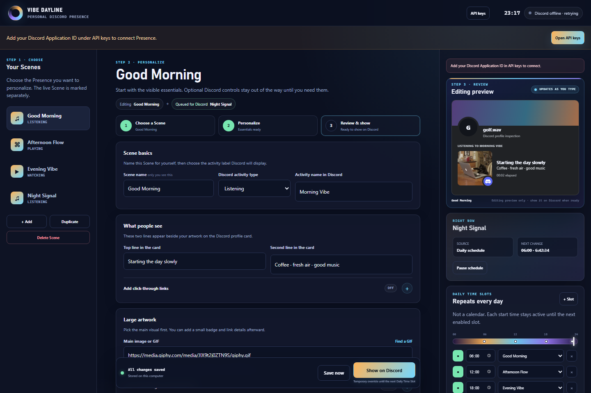
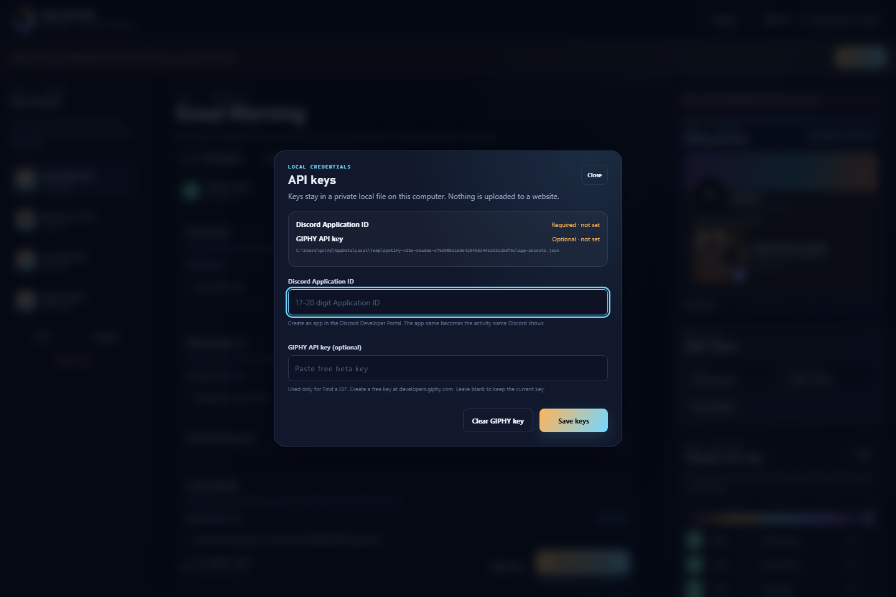
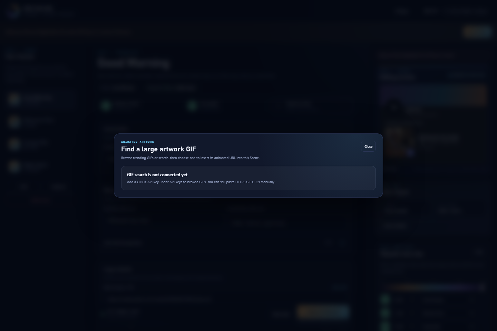
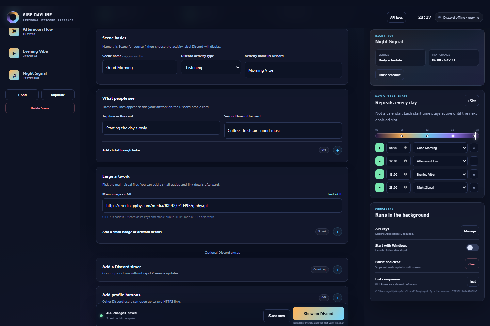

# Spotify Vibe / Vibe Dayline

Personal Windows utility that schedules customized **Discord Rich Presence** scenes from recurring local-time slots.

This is a local companion app, not a hosted website. Spotify showcase code under `src/` is a leftover visual prototype and is optional.

## Features

- Create, edit, duplicate, and delete Rich Presence **Scenes**
- Linear editor flow: **Choose a Scene → Personalize → Review and show on Discord**
- Assign scenes to repeating **Daily Time Slots** (`06:00`, `12:00`, …)
- Temporary **Manual Override** until the next enabled slot
- Local-only config + secrets (no cloud account)
- Optional GIPHY search for scene artwork
- First-run **API keys** page in the Studio UI
- Optional **Start with Windows** so Presence keeps running after reboot

### Presence Studio preview



*Scene library, editor, Discord-style preview, and daily schedule in one local page.*



*Paste your Discord Application ID and optional GIPHY key. Credentials stay on this PC only.*



*Browse or search GIFs for scene artwork after a GIPHY key is saved.*



*Enable the companion to launch hidden after Windows sign-in so you do not need to run it manually every day.*

## Requirements

- Windows (autostart is Windows-only; Studio itself can run where Node runs)
- [Node.js](https://nodejs.org/) 20+ and npm
- Discord Desktop signed in, with activity sharing enabled:
  **User Settings → Activity Privacy**
- A Discord application from the [Discord Developer Portal](https://discord.com/developers/applications)
- Optional free GIPHY beta key from the [GIPHY Developer Dashboard](https://developers.giphy.com/dashboard/?create=true)

## Quick start

```bash
npm install
npm run presence:studio
```

The companion starts and opens:

```text
http://127.0.0.1:17345
```

### First-run setup (API keys page)

1. Studio opens an **API keys** dialog when Discord is not configured yet.
2. Paste your **Discord Application ID** (17–20 digit number from the Developer Portal).
3. Optionally paste a **GIPHY API key** if you want the Find a GIF browser.
4. Click **Save keys**.

Keys are stored only on your machine at:

```text
%APPDATA%\Spotify Vibe\app-secrets.json
```

Scene and schedule data is stored separately at:

```text
%APPDATA%\Spotify Vibe\presence-config.json
```

You can reopen the page any time from **API keys** in the header or **Companion → Manage**.

### Alternative setup methods

CLI Application ID (automation / power users):

```bash
npm run presence:studio -- YOUR_APPLICATION_ID
```

Environment variables:

```bash
# PowerShell example
$env:DISCORD_CLIENT_ID="YOUR_APPLICATION_ID"
$env:GIPHY_API_KEY="YOUR_GIPHY_KEY"
npm run presence:studio
```

Clipboard / CLI GIPHY helper (optional):

```bash
# copy only the GIPHY key first, then:
npm run presence:giphy-setup

# or pass the key directly:
npm run presence:giphy-setup -- YOUR_GIPHY_KEY
```

## Keep it running all day (recommended)

Presence is owned by the **Background Companion** (a local Node process), not by the browser tab.

### What to leave open

| Component | Required? | Notes |
| --- | --- | --- |
| Discord Desktop | Yes | Must be signed in with activity sharing enabled |
| Background Companion | Yes | Applies Scenes and watches the clock |
| Presence Studio browser tab | No | Safe to close after setup |

Closing the Studio tab does **not** stop Presence.

### Enable Start with Windows

Do this once after first setup so you do not need to run `npm run presence:studio` every reboot:

1. Start the app once:
   ```bash
   npm run presence:studio
   ```
2. Save your **Discord Application ID** under **API keys**.
3. In the right panel, open **Companion**.
4. Turn **Start with Windows** on.

After that:

- Windows sign-in starts the companion hidden (no Studio browser window).
- Daily Time Slots keep switching Scenes automatically.
- Open Studio later only when you want to edit Scenes:
  - visit `http://127.0.0.1:17345`, or
  - run `npm run presence:studio` again (if the companion is already running, it reopens Studio instead of starting a second scheduler)

The autostart launcher is created at:

```text
%APPDATA%\Microsoft\Windows\Start Menu\Programs\Startup\Spotify Vibe Presence.vbs
```

### Stop or disable later

- **Pause schedule** — keeps current Presence visible, stops automatic Scene changes
- **Clear** — removes Rich Presence and pauses the schedule
- **Exit** — clears Presence and stops the companion for this session
- Turn **Start with Windows** off before Exit if you do not want it to return at the next sign-in

### Quick health checks

- Studio loads at `http://127.0.0.1:17345`
- Connection pill shows Discord connected
- Companion card shows **Start with Windows** enabled if you want reboot persistence

## Day-to-day use

1. Keep **Discord Desktop** running.
2. Keep the companion running (`npm run presence:studio`, or rely on Start with Windows).
3. Customize scenes and daily slots in the Studio when needed.
4. Leave the browser closed; the companion continues on its own.

### Controls

| Action | Effect |
| --- | --- |
| Show on Discord | Temporary manual override until the next enabled slot |
| Pause schedule | Stops automatic scene changes; current presence stays |
| Clear | Removes Rich Presence and pauses the schedule |
| Exit | Clears presence and stops the companion |

## Scripts

| Command | Purpose |
| --- | --- |
| `npm run presence:studio` | Start Background Companion + Studio |
| `npm start` | Same as `presence:studio` |
| `npm run presence:giphy-setup` | Save GIPHY key from clipboard or argument |
| `npm test` | Run companion unit/integration tests |
| `npm run build` | Build the optional React showcase under `src/` |
| `npm run dev` | Run the optional React showcase |
| `npm run lint` | ESLint |

## Security notes

- Never commit `.env`, `app-secrets.json`, refresh tokens, or API keys.
- Studio binds to `127.0.0.1` only.
- GIPHY and Discord credentials are not returned by public config endpoints.
- The React/Spotify demo should use your own `.env` values if you run it; the repository ships no live secrets.

## Optional React / Spotify showcase

`src/` is an earlier editorial UI prototype. It is **not** required for Discord presence.

If you want to run it:

1. Copy `.env.example` to `.env`
2. Fill Spotify Client ID / Secret / Refresh Token for your own app
3. Run `npm run dev`

## Development checks

```bash
npm test
npx eslint scripts
npm run build
```

## Product docs

- [Personal Scheduled Discord Presence — Source of Truth](./docs/PERSONAL_SCHEDULED_PRESENCE_SOURCE_OF_TRUTH.md)
- [Discord Integration — Source of Truth](./docs/DISCORD_INTEGRATION_SOURCE_OF_TRUTH.md)
- [Domain language](./CONTEXT.md)
- [ADR 0004: Reduce to personal scheduled Presence](./docs/adr/0004-reduce-to-personal-scheduled-presence.md)

## Troubleshooting

**Studio says Discord is disconnected**
- Confirm Discord Desktop is open and signed in
- Confirm Activity Privacy allows activity sharing
- Confirm Application ID is correct under API keys

**Find a GIF is unavailable**
- Open API keys and save a valid GIPHY key
- Or paste any public HTTPS GIF/image URL into the scene artwork field

**Companion did not start after reboot**
- Confirm **Start with Windows** is still enabled in Studio
- Confirm the Startup launcher still exists:
  `%APPDATA%\Microsoft\Windows\Start Menu\Programs\Startup\Spotify Vibe Presence.vbs`
- Confirm Node.js is still installed and the repo path has not moved
- Start once manually with `npm run presence:studio`, then re-enable **Start with Windows**

**Port already in use**
- The companion is probably already running; it reopens `http://127.0.0.1:17345`
- Or start with another port: `npm run presence:studio -- --port=17346`

**Want a clean stop**
- Use **Exit** in Studio, or press `Ctrl+C` in the terminal that launched the companion

## License

Private / personal project unless you add an explicit license.
