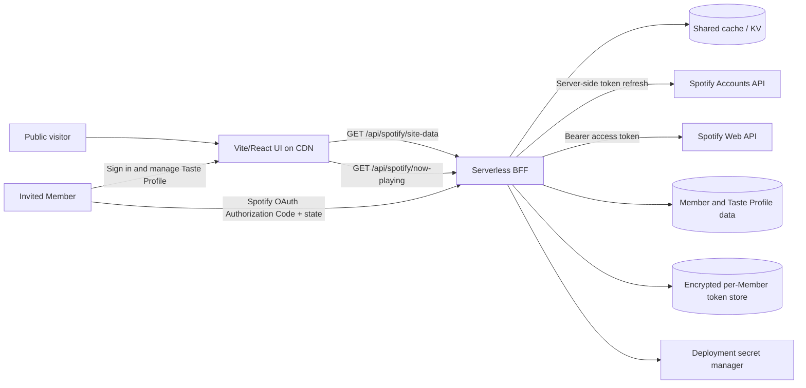

# Spotify Integration — Source of Truth

> **Status:** Approved technical baseline; monetization is blocked pending a compliant product pivot or written Spotify approval  
> **Spotify documentation last verified:** July 15, 2026  
> **Scope:** A non-commercial, invite-only alpha where each Member connects Spotify to test a public music-identity experience with at most five authorized Spotify users

This is the authoritative Spotify integration document for this repository. If this document conflicts with current official Spotify documentation, the official documentation wins and this file MUST be updated immediately.

Normative language:

- **MUST / MUST NOT** — required for security, correctness, policy compliance, or the approved architecture.
- **SHOULD / SHOULD NOT** — the recommended default; deviations require a documented reason.
- **MAY** — optional.

## 1. Executive verdict

The project is **technically feasible** with the Spotify Web API and OAuth 2.0, but it requires a backend or serverless function.

- Each invited Member authorizes the application through Spotify OAuth.
- A server-side component stores the app `client_secret` and each Member's refresh token separately in encrypted storage.
- Public visitors read only sanitized data from this project's backend.
- Spotify provides no documented account-playback webhook, so playback status requires polling.
- Development Mode is sufficient for a closed alpha of at most five connected Members, but not for unrestricted public signup. The app owner MUST maintain Spotify Premium.
- A Spotify client secret or any Member refresh token MUST NEVER be included in browser JavaScript.

The project is **not currently viable as a paid multi-member Spotify product**:

- Spotify states that Development Mode is for learning, experimentation, and personal projects for non-commercial use. It also states that Development Mode should not be relied on as a foundation for building or scaling a business on Spotify.
- Development Mode permits only five authorized Spotify users. Current Extended Quota eligibility requires an established organization and a launched service with at least 250,000 monthly active users, among other requirements.
- Spotify prohibits analyzing Spotify Content or the Spotify Service to create derived listenership metrics, user metrics, or profiles of users. Inferred taste types, compatibility scores, listening personalities, AI summaries, and derived rankings are therefore out of scope without separate written authorization.
- Spotify data and content MUST NOT be sold or offered as a standalone product. A commercial service must sell independent functionality and remain compliant with every Spotify policy and quota requirement.

**Commercialization gate:** The Spotify-connected alpha MUST remain free and non-commercial. Before billing is enabled for a product that uses Spotify Platform data, the project MUST either obtain written Spotify approval for the exact use case and appropriate production access, or pivot the paid product so its core value and Member data do not depend on the Spotify API.

### Go / no-go matrix

| Requirement | Result | Notes |
|---|---:|---|
| Display a Member's playlists | ✅ | Use `GET /me/playlists` and `GET /playlists/{id}/items` with that Member's authorization |
| Display the currently playing or paused item | ✅ | Use `GET /me/player` or `/me/player/currently-playing` |
| Update status near real time | ✅ | Use polling through a shared server cache; there is no documented push webhook |
| Display recently played or top tracks | ✅ | Optional and privacy-sensitive |
| Let public Visitors control a Member's Spotify account | Technically possible, but **prohibited by this project** | High-risk and outside the requirement |
| Play full tracks through a fully custom player | ⚠️ | Requires Web Playback SDK, authenticated Premium listeners, and is constrained by Development Mode |
| Use `preview_url` as the primary player | ❌ | The field is Deprecated, Nullable, and may be absent |
| Receive account playback events through a webhook | ❌ | No playback webhook/push API is documented |
| Support many authenticated Spotify users in Development Mode | ❌ | Development Mode allows at most five authenticated Spotify users |
| Charge Members for the Spotify-connected Development Mode product | ❌ | Development Mode is explicitly positioned for non-commercial experimentation and must not underpin a business |
| Infer a Member's taste type, personality, compatibility score, or derived listening metrics | ❌ | Spotify policy prohibits derived listenership/user metrics and building profiles of users |
| Sell access to Spotify metadata, artwork, listening history, or a Spotify-derived profile | ❌ | Spotify Content/data cannot be sold or offered as a standalone product |
| Let a Member deliberately share an official Spotify URL or narrowly permitted playlist metadata to Discord | ⚠️ | Requires specific consent, attribution, deep links, and review against Spotify's transfer restrictions |
| Sell independent, non-streaming customization after obtaining appropriate production access | ⚠️ | Commercial use can be permitted for a compliant Non-Streaming SDA, but Development Mode and all other policy restrictions still apply |

## 2. Mandatory architecture



### Approved project decisions

1. Public visitors MUST NOT log in to Spotify and MUST NOT receive any Spotify token.
2. The project MUST use a same-origin serverless Backend-for-Frontend (BFF). It MUST NOT expose a generic Spotify proxy.
3. The first release is a multi-member Closed Alpha. Becoming a Member is invite-only and capped at five Spotify-connected Members while the app remains in Development Mode; Visitors remain unrestricted.
4. Each Member MUST control an explicit playlist allowlist, and the service MUST validate that the connected Member owns or collaborates on every displayed playlist.
5. The MVP MUST use cached polling for now-playing status. WebSocket or SSE is unnecessary initially.
6. Public playback controls are out of scope and MUST NOT be exposed.
7. `preview_url` MUST NOT be the primary playback path. The MVP SHOULD use an **Open/Listen on Spotify** link; Spotify Embed MAY be added later.
8. If Spotify reports a Private Session, the public API MUST return `private` and MUST NOT expose the item.
9. Recently Played and Top Tracks are opt-in per Member. The default MVP is playlists plus now-playing only.
10. Every token, cache entry, playlist allowlist, and private management action MUST be isolated by Member. Cross-Member data access is a release blocker.

### Why Member tokens must remain behind the BFF

The site displays data from connected Members to anonymous Visitors. If any Member refresh token is placed in the SPA, Visitors can steal it and mint access tokens for that Member's Spotify account.

Authorization Code with PKCE can protect a public client during authorization, but it does not provide the server-side privacy boundary, shared cache, or public-profile data isolation this product requires. The approved architecture therefore uses server-side Authorization Code Flow and never sends refresh tokens to the browser.

## 3. Spotify account, quota, and 2026 restrictions

### Development Mode

For newly created apps beginning February 11, 2026:

- The app owner MUST have an active Spotify Premium subscription. The app stops working if Premium lapses and resumes after the owner resubscribes.
- A developer can create one Development Mode Client ID.
- An app can have at most five authenticated Spotify users.
- A user must be added to the app allowlist before that user's access token can successfully call the API.
- Spotify explicitly describes Development Mode as suitable for apps that access or manage one Spotify account, which matches this project.
- Spotify's February 2026 platform announcement describes Development Mode as supporting non-commercial learning, experimentation, and personal projects, and says it should not be used as the foundation for building or scaling a business.

**Project implication:** Only invited Members count as authenticated Spotify users. Visitors call only this project's BFF, so the five-user Spotify allowlist does not limit public viewing traffic. The alpha MUST remain non-commercial, and Spotify's app-wide rate limit still applies, so shared, Member-keyed caching is mandatory.

Unless the Spotify Developer Dashboard proves that an existing app is governed by different grandfathered behavior, agents MUST assume the current Development Mode restrictions apply.

### Extended Quota Mode

Extended Quota Mode is unnecessary for the MVP and is generally unavailable to a personal project. Spotify currently accepts applications from organizations rather than individuals and lists requirements including an established business, a launched service, availability in key Spotify markets, commercial viability, and at least 250,000 monthly active users.

Extended Quota approval only changes API access and quota. It does not waive the Developer Policy's restrictions on derived profiles, selling Spotify data, transferring Spotify Content, or commercial streaming.

### Commercial use and derived-profile restrictions

Spotify distinguishes a **Non-Streaming SDA** from a **Streaming SDA**:

- A compliant Non-Streaming SDA may sell advertising, sponsorships, promotions, or access to the application.
- Commercial uses of a Streaming SDA are prohibited except with the required separate permission. The Web Playback SDK also requires prior written Spotify approval for commercial projects.

This permission does not override other restrictions. The project MUST NOT:

- derive taste archetypes, compatibility scores, listening personalities, new listening metrics, or behavioral profiles from Spotify data;
- use Spotify data for advertising or marketing targeting;
- sell Spotify metadata, artwork, history, or a Spotify-derived profile;
- ingest Spotify Content into an AI or machine-learning model;
- assume that publishing Spotify-derived data into Discord is permitted merely because a Member connected both accounts.

A safer commercial product may sell Member-authored curation, themes, hosting, profile URLs, and Discord presentation while using only user-entered content and official outbound links. Any later Spotify connector requires a fresh policy and quota review for the exact approved use case.

### Rate limits

- Spotify calculates the Web API rate limit across a rolling 30-second window.
- Spotify does not publish one fixed numeric limit in its public documentation.
- Development Mode has a lower limit than Extended Quota Mode.
- Some endpoints can have endpoint-specific limits.
- On `429`, the application MUST honor the `Retry-After` response header and MUST NOT retry immediately in a tight loop.

## 4. OAuth and token lifecycle

### Required flow

The project MUST use **server-side Authorization Code Flow** with `state` validation for CSRF protection.

- Browser or mobile apps that cannot protect a secret SHOULD use PKCE, but PKCE is not the approved public-data architecture here.
- Client Credentials Flow cannot access user resources such as `/me/*`, current playback, listening history, or a Member's playlists.
- An access token is valid for one hour (`3600` seconds).
- A refresh token issued to an app registered in the Developer Dashboard is valid for **six months**.
- Refreshing an access token does **not** extend the refresh token's six-month lifetime.
- The project MUST provide a Member reauthorization flow before refresh-token expiry.
- If the token endpoint returns `invalid_grant`, the application MUST stop retrying, disconnect only the affected Spotify connection, discard its invalid token, and require that Member to authorize again.

### Redirect URI rules

- Production redirect URIs MUST use HTTPS and MUST exactly match the registered value.
- Local development MUST use an explicit loopback IP, for example `http://127.0.0.1:5173/callback`.
- `http://localhost:...` is not allowed.
- Dynamic ports are supported only for loopback IP literals.

### Server-only environment variables

Store these values in the deployment secret manager, never in the client bundle:

```dotenv
SPOTIFY_CLIENT_ID=
SPOTIFY_CLIENT_SECRET=
SPOTIFY_REDIRECT_URI=
TOKEN_ENCRYPTION_KEY=
```

Each Member's encrypted refresh token, token issue time, granted scopes, Spotify account identifier, public playlist allowlist, and sharing preferences MUST be stored as Member-owned data—not as deployment environment variables. Secrets and refresh tokens MUST NOT use the `VITE_` prefix because Vite exposes referenced `VITE_` variables to browser code.

## 5. Relevant endpoints and scopes

### Core features

| Feature | Endpoint | Scope | Important constraints |
|---|---|---|---|
| Current Member's playlists | `GET /me/playlists` | `playlist-read-private` | Returns owned **or followed** playlists; filter by the Member's allowlist, ownership/collaboration, and intended visibility |
| Playlist items | `GET /playlists/{playlist_id}/items` | `playlist-read-private` | Contents are available only when the current user owns or collaborates on the playlist; maximum 50 items per page |
| Lightweight now-playing | `GET /me/player/currently-playing` | `user-read-currently-playing` | Returns current item, progress, `is_playing`, timestamp, context, and playback type |
| Full playback state | `GET /me/player` | `user-read-playback-state` | Includes active device, Private Session flag, progress, shuffle, repeat, and current item; the BFF MUST discard device data before returning public data |
| Recently played | `GET /me/player/recently-played` | `user-read-recently-played` | Maximum 50 items; currently supports tracks, not podcast episodes |
| Top tracks or artists | `GET /me/top/{type}` | `user-top-read` | `short_term` ≈ 4 weeks, `medium_term` ≈ 6 months, `long_term` ≈ 1 year; maximum 50 items |

Recommended MVP scopes:

```text
playlist-read-private user-read-playback-state
```

If the implementation uses `/me/player/currently-playing` instead of `/me/player`, request `user-read-currently-playing` instead. Do not request both without a documented need.

Request optional scopes only when their feature is enabled:

- `playlist-read-collaborative` — only for intentionally displayed collaborative playlists
- `user-read-recently-played` — only when Recently Played is enabled
- `user-top-read` — only when Top Tracks is enabled
- `user-modify-playback-state` — only for protected controls used by that same Member
- `streaming` — only for Web Playback SDK; the listener must have eligible Premium

`user-read-email` and `user-read-private` are not required for this project's stated requirements.

### Playback controls available through the API

Spotify Web API supports start/resume, pause, next, previous, seek, repeat, volume, shuffle, playback transfer, queue read, and add-to-queue. These operations use `user-modify-playback-state`, require Premium, and may fail on restricted or unavailable devices.

**Project policy:** These operations MUST NOT be exposed to anonymous Visitors. A future Member control surface MUST authorize the Member against the same Spotify connection and MUST have CSRF protection and project-level rate limiting.

### Playlist write operations

The API supports playlist creation and modification, including adding, updating, and removing items with `playlist-modify-public` or `playlist-modify-private`. These permissions are unnecessary for the current requirements and MUST NOT be requested in the MVP.

## 6. Breaking changes the implementation must support

### February 2026 playlist migration

| Legacy | Current |
|---|---|
| `GET /playlists/{id}/tracks` | `GET /playlists/{id}/items` |
| Playlist field `tracks` | `items` |
| Nested `tracks.tracks` | `items.items` |
| Nested `tracks.tracks.track` | `items.items.item` |

The legacy `/tracks` reference is marked Deprecated, while the changelog and migration guide describe it as replaced by `/items`. New implementation code MUST treat `/tracks` as unavailable and migrate immediately.

Additional 2026 changes relevant to this project:

- Playlist contents are returned only for playlists the authenticated user owns or collaborates on. Other followed playlists expose metadata only.
- `GET /browse/new-releases` was removed with no direct replacement.
- `GET /users/{id}` and `GET /users/{id}/playlists` were removed; use `/me` and `/me/playlists`.
- Track and album `external_ids`, initially announced as removed in February, were restored in March 2026.
- The May 2026 changelog added a public, immutable, pseudoanonymous `account_id` to `GET /me`. The MVP does not need it.
- Playlist image URLs returned by `/me/playlists` are temporary and can expire in less than one day.

### Audio preview

`preview_url` is a 30-second MP3 field currently documented as **Nullable and Deprecated**. Spotify policy also prohibits using Audio Preview Clips as a standalone service. The application MUST tolerate `null` and MUST NOT build its primary playback experience around this field.

Approved playback options, in order:

1. **MVP default:** `OPEN SPOTIFY` or `LISTEN ON SPOTIFY` deep links.
2. Spotify Embed for a Spotify-controlled interactive track, album, or playlist player.
3. Web Playback SDK only if the product accepts authenticated eligible-Premium listeners and Development Mode's five-user constraint.

## 7. Now-playing update strategy

Spotify Web API is REST-based and its current documentation and OpenAPI schema expose no account-playback webhook, subscription, SSE, or WebSocket API. Account-wide now-playing status therefore requires polling.

### Project polling and caching policy

The following values are project recommendations, not Spotify-guaranteed limits:

| Data | Server cache TTL | Browser behavior |
|---|---:|---|
| Now playing | 10–15 seconds | Poll the BFF every 15–30 seconds while the tab is visible; pause or slow polling while hidden |
| Recently played | 2–5 minutes | Lazy-load when the section becomes relevant and the cache is stale |
| Playlist metadata/items | 10–60 minutes | Use `snapshot_id` to avoid reloading unchanged playlist contents |
| Top tracks | 6–24 hours | Do not reload on every page view |

Operational rules:

- When there are no visitors, the service SHOULD NOT poll Spotify in the background.
- All visitors MUST share the same cache; the implementation MUST NOT make one Spotify request per visitor.
- Use CDN `s-maxage`/`stale-while-revalidate` or shared KV so caching works across serverless instances.
- The browser SHOULD extrapolate progress from `progressMs`, `durationMs`, `isPlaying`, and `observedAt`.
- Every poll SHOULD resynchronize the client to correct clock drift and detect track changes.

### Approved public DTO

```json
{
  "status": "playing",
  "observedAt": "2026-07-15T12:00:00.000Z",
  "progressMs": 42000,
  "track": {
    "id": "spotify-track-id",
    "name": "Track name",
    "artists": ["Artist name"],
    "durationMs": 210000,
    "artworkUrl": "https://i.scdn.co/...",
    "spotifyUrl": "https://open.spotify.com/track/...",
    "explicit": false
  }
}
```

Allowed `status` values are `playing | paused | idle | private | unavailable`.

The public response MUST NOT contain `device.id`, `device.name`, access tokens, refresh tokens, raw Spotify responses, email addresses, or unrelated account fields.

### Error behavior

| Spotify response | Required BFF behavior |
|---|---|
| `200` | Normalize and cache only allowlisted fields |
| `204` or no active playback | Return `idle`; fall back to recently played only when that Member explicitly enables it |
| `401` | Refresh the access token once; if it still fails, require reauthorization |
| `403` | Check Premium, app allowlist, scope, and playlist ownership; do not retry rapidly |
| `429` | Honor `Retry-After` and serve stale cache |
| `5xx` or network failure | Serve stale cache; return `unavailable` when no cache exists |

## 8. Privacy, storage, and design compliance

### Privacy and data handling

- The site MUST clearly disclose that now-playing, Top Tracks, or listening history is being published to the public.
- Every Member MUST have a simple kill switch for public now-playing sharing.
- A future multi-user version MUST provide a Privacy Policy and an accessible disconnect mechanism, and MUST stop accessing and delete a user's Spotify Personal Data when the user disconnects or requests deletion.
- The application MUST request, store, and return only data required by enabled features.
- Spotify Content MUST NOT be stored indefinitely.
- Temporary local caching of metadata and cover art is allowed only when strictly necessary for performance and functionality.
- Private Session MUST override every sharing or fallback rule.

### Attribution and artwork

- Spotify metadata and artwork MUST be attributed with Spotify branding and MUST link back to the applicable Spotify item or playlist.
- Spotify artwork MUST remain in its original form. Do not crop, grayscale, filter, blur, animate, distort, overlay text or images, or place controls over it.
- Metadata MUST remain unaltered and legible. It may be truncated only if the user can access the full value.
- Spotify recommends 4px artwork corner radii on small/medium devices and 8px on large devices.
- Metadata, artwork, and Audio Preview Clips MUST NOT be offered as a standalone product.
- The site MUST add independent value—such as each Member's curation, notes, context, or visual narrative—rather than merely cloning Spotify.

## 9. Current repository audit

The working tree contains a Vite SPA experiment, not a production-safe Spotify architecture.

### Existing functionality

- The app loads Top Tracks, playlists, and Recently Played once on mount (`src/App.tsx:28-46`).
- It calls `/me/top/tracks` (`src/services/spotify.ts:70-89`).
- It calls `/me/playlists` and loads the first ten tracks per playlist (`src/services/spotify.ts:93-134`).
- It calls `/me/player/recently-played` (`src/services/spotify.ts:139-168`).
- `PreviewPlayer` plays `preview_url` through an HTML `<audio>` element. It is not a connected Member's Spotify account playback (`src/components/PreviewPlayer.tsx:14-34`).

### P0 blockers — do not deploy before resolving

1. `VITE_SPOTIFY_CLIENT_SECRET` and `VITE_SPOTIFY_REFRESH_TOKEN` are imported by frontend code (`src/services/spotify.ts:3-5`) and sent from the browser to the token endpoint (`src/services/spotify.ts:17-26`).
2. At the start of this audit, `.env` contained populated values and was not ignored. This research task added `.env` and `.env.*` to `.gitignore`, but credential rotation is still required if the app was ever built, served, deployed, or shared.
3. There is no now-playing request or polling. `PlayerState` is local UI state only (`src/types/index.ts:21-25`).
4. The code uses deprecated `/playlists/{id}/tracks` and `item.track` (`src/services/spotify.ts:103-120`) instead of `/items` and `item.item`.
5. `/me/playlists` is not filtered by owner, visibility, or explicit allowlist, so private, collaborative, or followed playlists could be published unintentionally (`src/services/spotify.ts:93-134`).
6. Each page view can produce many Spotify requests, with no shared cache or rate-limit handling.
7. The token helper uses `http://localhost:5173/callback`, which violates current redirect URI rules (`get-refresh-token.mjs:23-25`).
8. The token helper does not send or validate OAuth `state` (`get-refresh-token.mjs:214-220`, `265-271`, `306-312`).
9. The token helper prints and writes the refresh token using a `VITE_` name (`get-refresh-token.mjs:347-367`).
10. The current scope list omits a now-playing scope but requests unused `user-read-email` and `user-read-private` scopes (`get-refresh-token.mjs:27-34`).
11. The UI crops, grayscales, and overlays controls on Spotify artwork, which conflicts with Spotify Design Guidelines (`src/components/TopTracks.tsx:21-25`, `src/components/Playlists.tsx:30-46`).
12. `playlist.images` contains different resolutions of one playlist cover, not separate images for a collage. The current mapper and UI interpret it incorrectly (`src/services/spotify.ts:128`, `src/components/Playlists.tsx:30-39`).
13. The UI section is labeled “New Releases,” but its data is Recently Played. Spotify removed the New Releases endpoint (`src/components/RecentlyPlayed.tsx:3-6`, `src/services/spotify.ts:139-167`).

If this app has ever been built, served, deployed, or shared, treat the current client secret and prototype refresh token as exposed: rotate the client secret, revoke and reauthorize the affected Spotify connection, and inspect deployment artifacts and logs.

## 10. Implementation plan

### Phase 0 — secure immediately

- Rotate credentials if the app has ever been built, served, deployed, or shared.
- Ignore `.env` and `.env.*`; create a value-free `.env.example`.
- Remove Spotify token exchange and all secrets from frontend code.
- Replace the redirect URI with HTTPS or an explicit loopback IP.
- Keep the Spotify-connected alpha free and non-commercial; do not add billing to the Development Mode integration.
- Treat inferred Taste Profile features and automated Spotify-derived Discord publishing as blocked pending written Spotify approval.

### Phase 1 — identity, BFF, and Member OAuth

- Implement a server-only token service with single-flight access-token refresh.
- Validate OAuth `state`; bind the callback to the authenticated Member; store each refresh token encrypted and separately.
- Record refresh-token issue time and alert each affected Member before the six-month expiry.
- Enforce invite-only membership, a maximum of five connected Members, and Member-level data isolation.
- Implement purpose-specific endpoints such as `/api/spotify/site-data` and `/api/spotify/now-playing`.

### Phase 2 — playlist migration

- Configure an explicit playlist ID allowlist.
- Replace `/tracks` with `/items` and `track` with `item`.
- Support pagination, `snapshot_id`, null/local items, and temporary image URLs.
- Normalize public DTOs and include Spotify deep links.

### Phase 3 — now playing

- Add cached polling and visible/hidden tab behavior.
- Support `playing`, `paused`, `idle`, `private`, and `unavailable`.
- Handle `204`, `401`, `403`, `429`, `5xx`, token expiry, and stale cache.
- Extrapolate progress in the UI without calling Spotify every second.

### Phase 4 — compliant UI

- Remove cropping, filters, and overlays from Spotify artwork.
- Add Spotify attribution and deep links.
- Add per-Member disclosure and privacy kill switches.
- Rename “New Releases” to “Recently Played,” or remove the section.

### Phase 5 — optional playback

- Use Spotify Embed if public playback is required in Spotify-controlled UI.
- Use Web Playback SDK only if authenticated Premium listeners and the five-user Development Mode limit are acceptable.
- Public playback controls remain out of scope.

## 11. Production acceptance criteria

- [ ] Build artifacts contain no client secret, refresh token, or server-only environment value.
- [ ] The browser calls only the same-origin BFF and never calls the Spotify Accounts token endpoint.
- [ ] Public API responses contain only explicitly allowlisted DTO fields.
- [ ] Only approved playlist IDs are displayed; private or followed playlists cannot leak unintentionally.
- [ ] The implementation uses `/items` and `items[].item`, not legacy playlist fields.
- [ ] Now-playing changes appear within approximately one polling interval without one Spotify call per visitor.
- [ ] Private Session, `204`, access-token expiry, six-month refresh-token reauthorization, `429`, and stale fallback are handled.
- [ ] Spotify artwork is not cropped, filtered, or overlaid and has required attribution and links.
- [ ] No public endpoint can modify playback or playlists.
- [ ] Every Member has a kill switch for public now-playing sharing.
- [ ] A documented runbook covers credential rotation, token revocation, and reauthorization before six months.

## 12. Official sources

The following official Spotify sources were inspected directly on the verification date above:

1. [Web API overview](https://developer.spotify.com/documentation/web-api) — capabilities and Premium requirement
2. [Authorization](https://developer.spotify.com/documentation/web-api/concepts/authorization) — Authorization Code, PKCE, and Client Credentials use cases
3. [Authorization Code Flow](https://developer.spotify.com/documentation/web-api/tutorials/code-flow) — server-side OAuth and `state`
4. [Refreshing tokens](https://developer.spotify.com/documentation/web-api/tutorials/refreshing-tokens) — one-hour access tokens and six-month refresh tokens
5. [Redirect URIs](https://developer.spotify.com/documentation/web-api/concepts/redirect_uri) — HTTPS, loopback IPs, exact matching, and the `localhost` prohibition
6. [Quota modes](https://developer.spotify.com/documentation/web-api/concepts/quota-modes) — Development Mode, five-user limit, Premium owner, and Extended criteria
7. [February 2026 migration guide](https://developer.spotify.com/documentation/web-api/tutorials/february-2026-migration-guide) — one Client ID, five users, endpoint migration, and field migration
8. [Rate limits](https://developer.spotify.com/documentation/web-api/concepts/rate-limits) — rolling 30-second window, `429`, `Retry-After`, and `snapshot_id`
9. [Scopes](https://developer.spotify.com/documentation/web-api/concepts/scopes)
10. [Get Current User's Playlists](https://developer.spotify.com/documentation/web-api/reference/get-a-list-of-current-users-playlists)
11. [Get Playlist Items](https://developer.spotify.com/documentation/web-api/reference/get-playlists-items)
12. [Get Playback State](https://developer.spotify.com/documentation/web-api/reference/get-information-about-the-users-current-playback)
13. [Get Currently Playing Track](https://developer.spotify.com/documentation/web-api/reference/get-the-users-currently-playing-track)
14. [Get Recently Played Tracks](https://developer.spotify.com/documentation/web-api/reference/get-recently-played)
15. [Get User's Top Items](https://developer.spotify.com/documentation/web-api/reference/get-users-top-artists-and-tracks)
16. [Start/Resume Playback](https://developer.spotify.com/documentation/web-api/reference/start-a-users-playback) — Premium/control scope and playback policy notes
17. [February 2026 changelog](https://developer.spotify.com/documentation/web-api/references/changes/february-2026)
18. [March 2026 changelog](https://developer.spotify.com/documentation/web-api/references/changes/march-2026)
19. [May 2026 changelog](https://developer.spotify.com/documentation/web-api/references/changes/may-2026)
20. [Get Track](https://developer.spotify.com/documentation/web-api/reference/get-track) — Deprecated and Nullable `preview_url`
21. [Spotify Embeds](https://developer.spotify.com/documentation/embeds)
22. [Web Playback SDK](https://developer.spotify.com/documentation/web-playback-sdk)
23. [Design & Branding Guidelines](https://developer.spotify.com/documentation/design)
24. [Spotify Developer Policy](https://developer.spotify.com/policy)
25. [Spotify Developer Terms](https://developer.spotify.com/terms) — storage, caching, and security-code requirements
26. [Official Web API OpenAPI schema](https://developer.spotify.com/reference/web-api/open-api-schema.yaml) — no documented webhook/subscription/SSE/WebSocket for account playback
27. [February 2026 platform access announcement](https://developer.spotify.com/blog/2026-02-06-update-on-developer-access-and-platform-security) — Development Mode is for non-commercial experimentation and must not underpin a business

## 13. Update policy

This document MUST be reviewed again when:

- Spotify publishes a new Web API changelog.
- The project approaches production launch or changes quota mode.
- The project adds an OAuth scope, playback, multi-user access, or monetization.
- The app moves from Development Mode to Extended Quota Mode.
- Ninety days have passed since the verification date, even if no new change was announced.
