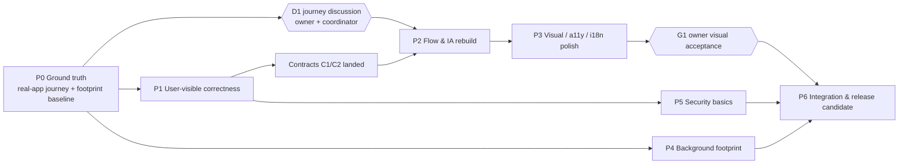

# Execution workflow v2 — Flow-first improvement

Status: **Ready to start Phase 0** (re-planned 2026-10-01 after owner decisions).
Previous review-run workflow: [archive/WORKFLOW-v1-review-run.md](archive/WORKFLOW-v1-review-run.md).
Agent rules: [`AGENTS.md`](../../AGENTS.md) · Coordinator/model routing: [`CLAUDE.md`](../../CLAUDE.md) ·
Findings and contracts: [IMPROVEMENT-SPEC.md](IMPROVEMENT-SPEC.md).

> สรุป: เริ่มจากดูแอปจริงก่อน (Phase 0) → แก้ bug ที่ผู้ใช้เห็น (1) → จัด flow/IA ใหม่ (2) → เก็บงานภาพ/a11y (3)
> คู่ขนานกับลดภาระ background (4) และ security พื้นฐาน (5) งาน infra หนักจากแผนเดิมพักไว้ (Parked)

## 1. Why the plan changed

| Owner decision (2026-10-01) | Effect on the plan |
| --- | --- |
| Product is **set-and-forget**: open rarely to edit Scene text or app pairing; companion runs in background | UX optimizes a short visit; background footprint becomes its own phase (P4) |
| Current journey "jumps around"; overall UX must improve | Real-app journey audit first (P0); flow/IA rebuild (P2) moved **before** heavy infra |
| Schedule / Daily Time Slots **removed** | F01, legacy-slot UI, DST policy, legacy compatibility notice dropped; old configs must still load and `slots` stay on disk |
| Use real Discord for verification | P0/P2/P3 walkthroughs may publish to the owner's account; activity is cleared at task end |
| Model routing: Opus 5.5 coordinates; **FE/design → Sonnet 5.5 (medium)**; **backend/logic/heavy review → Codex gpt-6.1-sol (medium)**; **fast work → Grok 4.7 (xhigh)** | See CLAUDE.md §1; author ≠ reviewer on every diff |
| The UX/UI journey is redesigned **together with the owner** | D1 becomes a live journey discussion between P0 and P2 |

The v1 plan stalled at Rework because each scrutiny round added infrastructure
(leases, legacy-writer handoff, profile descriptors, cross-tab prepare-exit,
GIF admission caps). For a single-owner local app these are **Parked** (§5)
until a concrete incident justifies them. The F-series bugs remain real and
are scheduled below.

## 2. Phase map



Lane occupancy (one writer per lane at a time; renderer = Sonnet, server/desktop = Codex):

| Wave | Renderer lane (Sonnet) | Server lane (Codex) | Desktop lane (Codex) | Read-only (Codex review / Grok fast) |
| --- | --- | --- | --- | --- |
| A | — | — | — | Grok: P0 journey audit ×2, footprint baseline |
| A′ | Sonnet: journey mockups for D1 (on request) | — | — | D1 discussion with owner |
| B | P1-R | P1-S (incl. C1/C2) | P1-D | Codex review of each P1 diff |
| C | P2 (sequential tasks) | P2 API support → P4-S | P5-D / P4-D | Codex review + Grok journey replay |
| D | P3 | P5-S | P4 leftovers | Codex review + Grok a11y/visual pass |
| E | P6 integration (Codex, one owner) | | | Fresh Codex final cross-lane review |

## 3. Phases

### P0 — Ground truth (Grok, fast; no source edits)

Goal: see the real app the way the owner uses it, and measure what "running in
the background" costs today. Everything later is judged against this baseline.

| Task | Model | Deliverable (under `execution/p0/`) |
| --- | --- | --- |
| P0-A Journey audit: first run → pick/edit Scene → pair app → Show → let it run → come back to change text | Grok | `journey-audit-a.md` + screenshots: every screen/state, each step counted, every place the owner must jump between pages or loses context, confusing copy, dead ends. Severity per friction |
| P0-B Journey audit: Settings, GIF picker, pause/hide/quit, close-to-tray, reopen, narrow window, TH/EN, light/dark, keyboard-only | Grok | `journey-audit-b.md` + screenshots |
| P0-C Footprint baseline (Windows) | Grok | `footprint-baseline.md`: CPU %, working set, handle/thread count, child processes (PowerShell helpers), wakeups/poll intervals for: CLI idle, Electron idle with window hidden, window visible-idle, during app switching. 10-min samples; method recorded so P4 can repeat it |

Rules: isolated profile env (AGENTS.md §4), real Discord running, clear activity
at end. Studio in the Orca browser at the isolated port for UI screenshots;
Electron (`npm run dev`) for tray/frameless/close behavior.

**Coordinator output:** `execution/p0/ia-proposal.md` — task-based IA for the
set-and-forget owner, merging P0 findings with UX review M1–M12/N1–N4. Starting
hypothesis to test, not a decision:

- **Home = "Now"**: what Discord shows, which app/Scene caused it, health in
  one line, one control strip (Auto / Pin / Pause / Hide).
- **Scenes**: list → detail, where detail holds text + art + *paired apps* +
  preview + one save/show rail. Pairing lives with its Scene, not on another
  page.
- **Settings**: connection, optional GIPHY, background/startup, language/theme,
  updates. Visible on every window size.
- Feedback for every action appears where the action was taken.

**Gate D1 — UX journey discussion (owner + coordinator, live in chat).**
The coordinator brings the P0 screenshots, friction list, footprint numbers and
the IA hypothesis; owner and coordinator agree the target journeys step by step
(e.g. "change Scene text", "pair a new app", "check what is showing",
"pause for a while"). Sonnet produces mockups of options on request. Output:
`execution/p0/ia-decision.md` — target journeys, screen list, what moves where,
and what is explicitly out. P2 starts only from this file.

### P1 — User-visible correctness (3 lanes in parallel)

| Task | Lane | Findings | Acceptance highlights |
| --- | --- | --- | --- |
| P1-S1 Contracts | Server | **C1**: `PUT /api/app-mappings` saves mappings only — never toggles Auto/pause or clears pin; Auto activation is a separate command. **C2**: `/api/state` exposes `desired {sceneId, source}`, `applied {sceneId, source, at}`, `detection {status, observedAt}`, `connection`, `revision` | HTTP-level tests; old renderer still works or coordinator sequences the switch |
| P1-S2 Persistence | Server | F02, F08, F14, F15 | Failed save leaves memory+disk unchanged; no delete-before-rename; split-UTF-8 Thai/emoji body round-trips; byte cap 1 MiB + 5 s read deadline; expiry write failure still reschedules |
| P1-S3 Delete Scene | Server | F04 backend | One request deletes Scene + listed mapping refs atomically, with expected revision |
| P1-R1 Editor integrity | Renderer | F09, F03-lite | Timer fields round-trip untouched across edit/select/duplicate/save/reload; slow save A → type B → B remains, label says saving until B acked |
| P1-R2 Delete + retry | Renderer (after P1-S3, P1-S1) | F04 UI, F10 | Confirm lists affected apps; removed only after commit; failed mapping save → Retry resends the same intent |
| P1-R3 Remove schedule migration | Renderer | F01 (rescoped) | Opening Studio performs no write; schedule-mode configs are treated as app mode in memory; `slots` untouched on disk |
| P1-D1 Desktop crash fixes | Desktop | F07, F06, tray fallback (F16-lite) | Void `send` cannot throw; Electron never loads a foreign listener on an occupied port; tray failure keeps window + Quit reachable |

Multi-tab 409 conflicts (rest of F03) are Parked: Studio is single-owner, single
window in practice.

### P2 — Flow & IA rebuild (Sonnet renderer, sequential; needs D1 + C1/C2)

Implements `ia-decision.md` in small slices; each slice gets a Codex review
(logic/state) and a Grok journey replay against the P0 baseline. The slice list
below is provisional and will be rewritten after D1:

1. **P2-1 Shell & navigation** — routes with real history (detail has a hash),
   Back returns to origin row/scroll, skip link, one overlay helper (M7, M8).
2. **P2-2 Now/Status** — truthful states from C2: applied vs selected vs
   paused vs no-matching-app vs detection-error vs disconnected (M4, F13 UI).
3. **P2-3 Scene detail** — text/art first, paired apps inside the Scene,
   preview, single save/show rail with pending/saved/failed (M3, M6, N2, N3).
4. **P2-4 Feedback & recovery** — per-screen status region; initial-load Retry;
   companion-unreachable ≠ Discord-disconnected (M5, F17).
5. **P2-5 Onboarding** — Start lands on the first real task; Discord Desktop
   dependency explained; GIPHY optional (N1, N4).

Acceptance per slice: Grok journey replay shows fewer steps/page jumps than the
P0 baseline for the same job, no regressions in other journeys, `npm test` green.

### P3 — Visual, accessibility, i18n polish (Sonnet renderer)

M9–M12, F18, F19: preview selector mismatch, contrast roles, accessible names,
responsive (390/768/1280/1440 + 200 % zoom), reduced motion posters, GIF picker
focus and bounded result window (48 buttons). Keep current tokens/identity
unless the owner approves a change. **Gate G1:** owner reviews screenshot pack
(desktop + narrow, TH/EN, light/dark, key states).

### P3-L — Brand mark / logo redesign (Sonnet, design)

Owner request 2026-10-01: the current ghost mark (`electron/assets/logo-ghost.svg`,
`icon.png/.ico/.icns`, inline SVG in the Studio brand bar and onboarding) feels
dated. Steps: (1) Sonnet produces 3–4 distinct directions as SVG concept sheets
(app icon at 16/32/256 px, tray icon on light/dark taskbar, in-app brand mark,
both themes) under `execution/p3/logo/`; (2) owner picks/iterates in chat;
(3) Sonnet finalizes the SVG and regenerates icons via `electron/build-icons.mjs`;
renderer brand mark updated in the same slice. Must stay legible at 16 px tray
size and must not imitate Discord/Spotify marks. Can start any time after D1;
does not block P1/P2.

### P4 — Background footprint (Codex server + desktop; starts after P0-C)

Targets are set from P0-C numbers; candidates to evaluate, each kept only if
measured better:

- Stop UI polling (`/api/state` every 500 ms) when Studio is hidden/closed;
  push or slow-poll when visible.
- Electron: destroy the renderer when hidden to tray, recreate on open (vs.
  keeping it alive) — measure RAM and reopen latency.
- One long-lived detection helper, never one PowerShell per poll; review its
  ~200 ms emit / ~1 s enumerate cadence and back off when nothing changes.
- Installed-app catalog scan only on explicit refresh / Studio open, single-flight.
- No RPC re-send when the activity is unchanged.

Acceptance: Grok repeats the P0-C method (Codex reviews the diffs); report before/after table; app
switching still updates Discord within the baseline latency.

### P5 — Security basics (Codex server + desktop)

F05 (Host/Origin validation, per-process token for mutations, JSON-only),
anti-framing headers, Electron navigation/IPC restricted to the owned Studio
document, CSP for the inline scripts. GIF provider: keep existing validation and
cache; add only a single-flight per query and abort on client disconnect.

### P6 — Integration & release candidate

One named integration owner (Codex, desktop lane) + fresh Codex final cross-lane review and a Grok fast smoke pass.
Full `npm test`, packaged Electron smoke on Windows (helpers + icon load outside
ASAR, tray, update check), real Discord walkthrough of the P0 journeys, F20
version/lock sync. Release itself requires explicit owner authorization.

## 4. Gates

| Gate | When | Who | Pass |
| --- | --- | --- | --- |
| D1 | End of P0 | Owner + coordinator (live discussion) | `ia-decision.md` agreed |
| Lane accept | Every task | Coordinator + Codex review (+ Grok fast pass where useful) | Tests green, no open Blocker/Major, ownership respected |
| Journey replay | Each P2 slice | Grok | Fewer steps/jumps than P0 baseline for the same job |
| G1 Visual | End of P3 | Owner | Screenshot pack accepted |
| Footprint | End of P4 | Grok measurement | Meets targets set from P0-C |
| G3 Discord | P6 | Owner + Grok | Correct Scene/art/buttons through switch, pause, pin, hide, reconnect |
| G4 Package | P6 | Desktop lane + Grok | Packaged app runs helpers, tray, update check on Windows |

## 5. Parked (do not implement without a new owner decision)

Per-file lease primitive and PID-incarnation recovery; legacy-writer quiescent
handoff; profile descriptor for relaunch/backout; cross-tab prepare-exit receipts
(single-window Quit still saves the current draft or asks); multi-tab revision
409 UX; GIF admission caps 2/8/32; schedule/DST/legacy-slot UI; update-feed
provenance pipeline beyond F20 sync. Reopen any item only with a reproduced
incident or an owner request.

## 6. Task spec template

```text
Task: <id> — <title>      Phase/Lane: <P1 / server>      Findings: <F.., M..>
Target: C:/letmecook-lab/spotify-vibe @ branch improve/flow-ux; files: <list>
Change: <one bounded user-visible result + state/side-effect contract>
Constraints: AGENTS.md §1, §4, §5; preserve owner data and hidden fields;
  no new deps; no edits outside Ownership; no commits.
Ownership: may edit <exact files>; must ask before touching anything else.
Observable acceptance: <scenarios>; focused tests <cmd>; npm test once;
  report at docs/improvement-review/execution/<phase>/<id>.md
  (verified vs inferred, unverified items, risks).
```

Review spec adds: `Diff: git diff <base>..HEAD -- <files>` (or working-tree
paths), `Lens: <correctness | state/persistence | UX journey | security |
footprint>`, output `<id>-review.md` with severity, `file:line`, failure
scenario, smallest fix.

## 7. Reporting cadence

- Coordinator reports to the owner (Thai) at every phase boundary and gate,
  and whenever a Blocker or scope question appears.
- `execution/LOG.md` gets one line per accepted/rejected task.
- Commits: one per accepted task on `improve/flow-ux`, explicit paths only.
  No push/merge/release without the owner.
