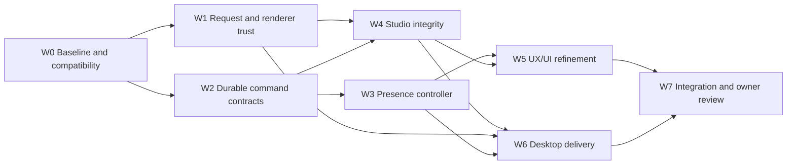

# Coordinator workflow and implementation handoff

Canonical product/technical contract: [IMPROVEMENT-SPEC.md](IMPROVEMENT-SPEC.md). This workflow describes execution after implementation is separately authorized. Current Run performs review and planning only.

## 1. Current review run

Run `run_bb0a60f802aa`; baseline `b241ccd5542b1f3e5ee348bd507cac051cafabda`.

| Task | Authoritative Dispatch | Output / scope |
| --- | --- | --- |
| `task_412721acfdf0` | `ctx_bbdeae7822be` | Runtime/state-flow report; `runtime-review.md` |
| `task_98319d91f8e6` | `ctx_c9778a5cb952` | All-surface UX/UI report; `ux-review.md` |
| `task_c184fd21cda4` | `ctx_2d361c61c0e0` | Security/Electron/persistence report; `security-lifecycle-review.md` |

Workers share the enclosing Orca folder workspace but target only the new clone through an absolute path. Each report has one writer. The coordinator owns canonical documents, reads source evidence independently, runs baseline tests and records accepted/rejected findings. There is no source editing or feature implementation in this run.

Launch preferences follow the configured Codex defaults; no model/effort is invented or overridden. Two initial Dispatches returned `outcome_unknown` with pasted prompts visibly unsent. After read-only inspection, the coordinator sent bare Enter to the exact existing terminal; later fleet evidence showed both agents working. No duplicate Task/editor was launched and no absence was treated as exit. An existing worker resource marked `user_takeover` stays user-owned; preserve that runtime decision.

## 2. Review acceptance loop

1. Freeze the baseline and assign runtime, UX and security/lifecycle lanes in one independent wave.
2. Inspect reports and cited source; reproduce important deterministic failures in pure or isolated fixtures. Record validation limits.
3. Deduplicate findings by failure mechanism. Include observable product consequences, a minimal correction and meaningful acceptance criteria in the canonical spec.
4. Dispatch a fresh full-plan reviewer with only the latest canonical artifact, workflow and raw repository source. The reviewer reads the artifact cold before prior reports, independently states intent, traces every claimed behavior and considers a smaller alternative. Lens rotates; it does not narrow the required full pass.
5. Coordinator accepts/rejects each Blocker/Major on source evidence and edits the canonical artifact. Record product choices, runtime gates, path coverage and resolved/new findings in `SCRUTINIZE-LOG.md`.
6. Repeat on the latest artifact until **two consecutive full passes find no new Blocker/Major** and old ones are resolved or have a legitimate external/runtime owner, experiment, pass condition and failure consequence. Cap is five because the plan crosses security, persistence and lifecycle. At the cap with unresolved design problems, verdict is Rework/Blocked, never automatic Ready.
7. Validate `worker_done` against active Task/Dispatch, process all delivered mail and reply to questions before acknowledging the FIFO Delivery. Choose release or a genuine immediate reuse; preserve runtime-marked user ownership. End only after every expected review Dispatch settles and no reclaimable resources remain.

The convergence criterion is about the plan, not the unchanged application's correctness. Source bugs are covered by work packages. Real UI, Windows, Discord and update proofs remain implementation release gates.

## 3. Future execution graph



At most three workers plus the coordinator. Create only ready work; dependencies encode real contract ordering. Preparation/testing inside a package may overlap, but accepted integration cannot bypass its dependencies. A new Run does not authorize implementation or reset worker-depth limits.

## 4. File ownership and safe waves

| Owner | Owned application files | Coordination seam |
| --- | --- | --- |
| Runtime worker | `studio-server.mjs`, `presence-config.mjs`, `presence-scheduler.mjs`, `app-presence.mjs`, `windows-apps.*`, `installed-apps.*`, `local-config-store.mjs`, `codex-session.mjs`, `application-badges.mjs`, `discord-application.mjs`, shared lease/resource/profile primitives and tests | Sole writer of admission/server/controller, registered-client exit receipts, profile descriptor/resolution, helper and HTTP/GIF glue; requires legacy-exit receipt before profile access |
| Security/lifecycle worker | `app-secrets.mjs`, `setup-giphy-key.mjs`, `electron/main.js`, `electron/preload.cjs`, `windows-autostart.mjs`, `giphy-search.mjs`, `character-art.mjs`, security/desktop tests; a small request-guard module if needed | Owns GIF admission/coalescing/cancellation/cache bounds and guard policy. Wires helper/secrets to shared per-file leases; runtime wires server and UX client. W6 assigns package/lock/CI metadata here after contract review |
| UX worker | `discord-presence-studio.html`, `studio-ci.css`, renderer interaction fixtures | Sole writer of draft/control transport, freeze/capture/save/discard exit preparation, bounded GIF/media/focus and dialogs |
| Integration/review owner | Explicit accepted paths, release/check receipts and current scope docs | One separately assigned owner handles integration; coordinator routes/validates, not unassigned post-review feature edits |

`package.json`, lockfile, config schema, public HTTP contract and shared startup/stop adapters require coordinator-reviewed contract changes with one assigned writer. No worker edits another lane's files opportunistically. If patches need incompatible simultaneous edits to a shared file, sequence them or use isolated Orca worktrees and one integration owner; never treat branch isolation as a substitute for ownership.

| Wave | Runtime lane | Security/lifecycle lane | UX lane | Coordinator gate |
| --- | --- | --- | --- | --- |
| A | W0 payload/profile/legacy fixtures; W2 storage/admission design and exit participant protocol | W1 trust/provider; W6 predecessor handoff, durable profile pointer and external layout | W0 state inventory and W4 freeze/save/cancel/discard contract | Agree revision/token/host/GIF, legacy exit, profile/relaunch, prepared-exit receipts and resource roots before wiring |
| B | Integrate W1/W2 admission/profile/control protocol, then W3 and helper resolver | W1 provider; W6 legacy/profile/resource seams; Quit/install waits for W4 preparation | W4 drafts/exit preparation/dialogs/GIF after W1/W2 | Assert zero pre-handoff/default-profile writes and real effects; no shared-file collisions |
| C | W3 recovery/performance proof | W6 packaged lifecycle/update proof | W5 hierarchy/i18n/a11y and isolated visual proof | Two clean full scrutinize passes on actual changes; owner visual review |
| D | Cross-lane W7 integration with one named owner | Security/release challenge | UX acceptance evidence | Full tests and mandatory runtime gates; explicit release authorization |

Security hotfixes such as the void-send updater bug can be isolated first when implementation is authorized. Do not bundle a full redesign into a correctness patch. Performance tuning starts from measured failures, not a framework migration.

## 5. Dispatch contract

Every future task states Target, Change, Constraints, Ownership and Observable acceptance. Include:

```text
Target: exact checkout, baseline commit, work package and named files.
Change: one bounded user-visible result and required state/side-effect contract.
Constraints: preserve local data, current app policy/art, backwards compatibility,
no broad staging, no release, no user-secret reads, no unrelated edits.
Ownership: exact writable files; owner of shared routing/renderer/host seams.
Observable acceptance: scenario matrix, focused commands, evidence output paths,
runtime proof limits, rollback and authoritative worker_done outcome.
```

No task is complete because tests were described, a server returned HTTP 200, a heartbeat arrived, or a screenshot was captured. Evidence must exercise the real failure boundary. User feedback overrides a worker's visual verdict. A rejected visual proposal stays local and cannot be reused as accepted work.

## 6. Reporting cadence and escalation

- At meaningful checkpoints, report completed scope, confirmed evidence, remaining uncertainty and the next resolving action in this chat; during active work keep updates within roughly one minute.
- Workers inspect coordinator mail at natural checkpoints and before completion, heartbeat only as the live preamble specifies, and use blocking `ask` for a decision they cannot infer. Coordinator replies to the same question ID.
- A worker can finish source review with explicit proof gates; it cannot turn missing evidence into a pass. Runtime experiment gates never replace an unresolved design/ownership choice.
- A timeout is a checkpoint. After repeated empty waits enumerate the Run's fleet and follow its literal nextAction. Retry only with positive failed/stopped evidence and `--retry-of`; preserve live/unverifiable resources.
- On a failed test: identify cause and owner, recover within the same task, rerun only the relevant checks. After one accepted full suite, broaden only if changes or unresolved concerns justify it.

## 7. Acceptance and release boundaries

For each package the coordinator reads the diff, validates major evidence, checks ownership and records Accepted / Rework / Runtime gate. Integration owner stages explicit accepted paths, preserves unrelated work and records commit provenance. No blanket `git add .`.

W7 acceptance requires G1–G6, verified legacy exit before shared-profile access, backups/backout, real helpers/icon, renderer prepared-exit receipts, matching resumed profile identities, truthful runtime results and owner visual acceptance. Unknown legacy/draft/profile state refuses the dependent action; keep data and offer specific recovery. Signing/feed/platform support are verified per target. No exposure is inferred from this planning request.

Current review result: **Rework at the five-round cap**. All eight review Tasks succeeded in delivering evidence; the final two accepted contracts were refined after Round 5 and need two consecutive independent clean full passes. Preparation of future work does not override this review gate or authorize feature implementation. See [SCRUTINIZE-LOG.md](SCRUTINIZE-LOG.md) for decisions and [COORDINATION.md](COORDINATION.md) for per-Task settlement.

The final handoff is one canonical spec, this executable workflow, a compact convergence log, supporting review evidence and a per-task Orca settlement receipt. Optional product extensions remain separate work.
