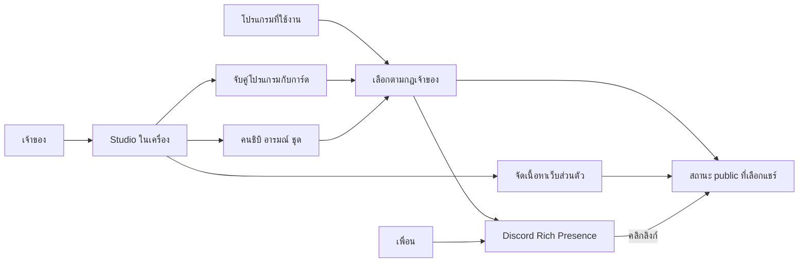

# Spotify Vibe — Final Plan Draft

> Update 2026-09-06: owner approved Hinata Court idle portrait v2 as the main CI art and temporary default, and authorized implementation. [ART-DIRECTION.md](ART-DIRECTION.md) supersedes unresolved appearance choices below. [IMPLEMENTATION-STATUS.md](IMPLEMENTATION-STATUS.md) tracks shipped slices and remaining work.

ฉบับร่างรวม 2026-09-05 · สถานะ: พร้อมทบทวนขอบเขต ยังมีการตัดสินใจที่ระบุท้ายเอกสาร

เอกสารนี้เป็นจุดเริ่มอ่านแผนล่าสุด ใช้แทนคำแนะนำเก่าที่ขัดกัน โดยเฉพาะเรื่องมาสคอต/ห้องเล่า lore และการให้ระบบเดาโหมดแทนเจ้าของ ไม่มีการอนุมัติรูปลักษณ์สุดท้ายหรือ deployment จากการมีเอกสารนี้

## 1. ผลลัพธ์ที่ต้องได้

เจ้าของเลือกโปรแกรมในเครื่องแล้วกำหนดการ์ด Discord ของโปรแกรมนั้นได้ ระบบสลับการ์ดตามการใช้งานให้เอง ใช้หน้าคนชิบิแบบ pixel art ที่ทำเองและปรับอารมณ์/ชุดได้ คนที่เห็นการ์ดกดไปสำรวจตัวตน รสนิยม และงานที่เจ้าของเลือกโชว์บนเว็บสาธารณะ

ให้ความสำคัญกับการแสดงตัวตนและความน่าสนใจในชีวิตประจำวัน ไม่ตั้งเป้าเป็นเครื่องมือติดตาม productivity

**ข้อกำหนดด้านประสบการณ์ที่เจ้าของเพิ่ม:** Studio ต้องดู seamless ใช้งานง่าย มีสีสันและ interaction/animation น่ารักที่สัมพันธ์กับการแต่ง Discord Presence ความละเอียดของภาพ การตอบสนองและสถานะต่าง ๆ เป็นส่วนที่ต้องส่งมอบในรุ่นแรก รายละเอียดอยู่ใน [Studio Experience & Motion Spec](STUDIO-EXPERIENCE-SPEC.md) ซึ่งเป็นส่วนหนึ่งของแผนนี้

## 2. สถานะของการตัดสินใจ

| เรื่อง | สถานะ |
|---|---|
| แอปส่วนตัวบน Windows หนึ่งเจ้าของ ใช้โปรเจกต์เดิมเป็นฐาน | ฐานระบบปัจจุบันและบริบทที่ใช้ร่าง |
| เจ้าของจับคู่โปรแกรมกับการ์ดเอง ระบบสลับตามกฎ | ผู้ใช้ยืนยัน |
| รุ่นแรกแยกตามโปรแกรม ไม่อ่านเว็บไซต์/แท็บใน browser | ผู้ใช้ยืนยันระหว่าง audit นี้ |
| หน้าคนชิบิน่ารัก สไตล์ 8-bit สีสด ทำภาพเองและ export GIF | ผู้ใช้ยืนยัน |
| เปลี่ยนอารมณ์และชุดได้ | ผู้ใช้ยืนยัน; อายุ override/จำนวนชุดยังเป็นข้อเสนอ |
| รูป/ข้อความ/ปุ่มบนการ์ดมีลิงก์ไปพื้นที่โชว์ตัวเจ้าของและผลงาน | ผู้ใช้ยืนยัน |
| หน้า public อินดี้ แปลก เท่; ไม่เป็นเรื่องราวของ GIF/มาสคอต | ผู้ใช้ยืนยัน |
| Studio ลื่น ใช้ง่าย สีสันและ animation น่ารัก พร้อมความใส่ใจในรายละเอียด | ผู้ใช้ยืนยัน; layout/palette/motion values ในสเปกเป็นข้อเสนอที่ต้องลอง |
| เปิดหลายแอปแล้วใครชนะ | รอคำตอบ; ร่างแนะนำ foreground ที่นิ่งต่อเนื่อง |
| โครงหน้าเว็บ/ชุดแต่ง/ระดับ editor | ยังไม่ล็อก เป็นรอบออกแบบ customization ถัดไป |

ค่าที่ระบุว่า “แนะนำ” ในเอกสารนี้เป็นร่างที่แก้ได้ ไม่ถือว่าผู้ใช้ยืนยันแล้ว

## 3. ส่วนประกอบของผลิตภัณฑ์

- **Local Studio:** เปิดผ่าน browser ในเครื่องเดิม มี companion อยู่เบื้องหลัง จึงเลือกและตรวจโปรแกรมใน Windows ได้ หน้าเว็บบน hosting เพียงอย่างเดียวทำหน้าที่ตรวจโปรแกรมในเครื่องไม่ได้
- **Discord surface:** การ์ดและข้อความตามข้อจำกัดของ Discord
- **Personal Space:** เว็บสาธารณะสำหรับผู้ชม เปิดได้โดยไม่ติดตั้ง companion หรือสมัครสมาชิก
- **Public assets/state:** ไฟล์ GIF และข้อมูลที่จำเป็นต่อเว็บ public; ไม่เปิด local Studio หรือ API จัดการเครื่องออกอินเทอร์เน็ต

ข้อมูลประกอบจากเครื่องระหว่าง audit: รายชื่อ process ที่มีหน้าต่างพบ Chrome, Discord, ChatGPT และ Willow Voice; รายการ Start Apps มี Visual Studio Code, Spotify, Steam และ Riot Client เป็นต้น เป็นภาพเฉพาะเวลาที่ตรวจ ไม่ใช่รายการแอปครบทั้งเครื่องหรือผลยืนยันว่าระบุ executable ของทุกแอปได้แล้ว

## 4. ฟีเจอร์รุ่นแรก

### F1 — โปรแกรมของเราและการจับคู่

- รายการโปรแกรมที่กำลังเปิดพร้อมชื่อ/ไอคอน และตัวบอกว่าโปรแกรมใดกำลังถูกใช้เลือก Presence
- เพิ่มจากแอปที่เปิดอยู่, ค้นหารายการติดตั้งที่ตรวจพบ, หรือเลือกไฟล์โปรแกรมเอง
- แยกรายการติดตั้งกับรายการที่กำลังรัน ไม่อ้างว่าพบทุกรูปแบบบน Windows
- รองรับโปรแกรม portable/launcher/Store app ที่ตรวจพบได้; รายการที่ระบุไม่ได้ต้องมีทางแก้การจับคู่ ห้ามเดารวมแอปชื่อเหมือนกัน
- การ์ดหนึ่งใบใช้ร่วมกันหลายโปรแกรมได้ หรือทำสำเนาแล้วแต่งเฉพาะโปรแกรม
- รายการบอกเมื่อการ์ดใช้ร่วมหลายแอปก่อนแก้/ลบ; ถ้าลบสิ่งที่ถูกอ้างอิงต้องให้เลือกตัวแทนหรือยกเลิก mapping อย่างชัดเจน
- ถอนการติดตั้ง/ย้ายตำแหน่งแอปแล้ว mapping ไม่หายเงียบ ๆ ให้แสดงว่า “หาโปรแกรมไม่พบ” และจับคู่ใหม่ได้
- รุ่นแรก Chrome เป็น Chrome ทั้งโปรแกรม ไม่แยก YouTube/GitHub/แท็บ/โปรไฟล์ browser

### F2 — การ์ด Discord ที่แต่งเป็นรายแอป

- ตั้ง activity type/name, รายละเอียดสองบรรทัด, GIF หน้าชิบิ, ไอคอนเล็ก, hover text, timer, field/image URLs และปุ่ม URL สูงสุด 2 ปุ่ม
- เพิ่มตัวเลือกข้อความใน member list ด้วย status_display_type ตามเอกสาร; ทดสอบการรองรับกับ client และ RPC ที่ใช้จริง
- ตัวเลือกพื้นฐานใช้ชื่อสื่อความหมาย คนใช้ไม่ต้องเห็นชื่อ field ของ Discord
- ข้อความ/ลิงก์เป็นสิ่งที่เจ้าของตั้ง ไม่มี AI เดาสิ่งที่กำลังสร้างหรือชื่อโปรเจกต์จากเครื่อง
- ตั้งลิงก์หลักร่วมทุกแอปได้ และกำหนดปลายทางเฉพาะแอปได้
- ลิงก์ภายในเลือกจากรายการชิ้นงาน/section ที่มีอยู่จริง เพื่อลด URL ขาดเมื่อแก้เนื้อหา
- รองรับค่าทั่วไปที่ไม่ระบุชื่อแอปหรือชื่อโครงการจริงบนการ์ด

### F3 — คนชิบิ อารมณ์ และชุด

- คนเดิมเป็นตัวแทนเจ้าของ มีใบหน้า/ผม/จุดจำสอดคล้องกัน ภาพแนว 8-bit สีสด
- เสนอ crop หัวถึงไหล่เพื่อเห็นชุด/ฮู้ด/เครื่องประดับ แต่ต้องลองขนาดการ์ดจริงก่อนเลือก
- แยกตัวตนพื้นฐาน, mood, outfit/accessories และ animation เพื่อเปลี่ยนส่วนหนึ่งได้โดยไม่เขียนทับทุกอย่าง
- ตั้งลุคเริ่มต้นต่อการ์ด/แอป และเลือก mood หรือ outfit ปัจจุบันเองได้
- แนะนำ mood/outfit override ข้ามแอปได้ เลือก 1 ชั่วโมงหรือจนปิด companion; มี “กลับตามการ์ด” และเวลาหมดอายุที่เห็นชัด
- เมนู mood อาจพ่วงชุดที่เจ้าของเลือกไว้ให้ mood นั้นได้; ลำดับลุคเสนอคือ outfit ที่เลือกเอง → ชุดที่ผูกกับ mood ที่เลือกเอง → ลุคเริ่มต้นของการ์ด ทั้งหมดต้องไม่เปลี่ยนหน้าตาหลักของคนเดิม
- เมื่อเปลี่ยนแอป ให้ข้อความ/ลิงก์ตาม app mapping; mood/outfit ที่เจ้าของ override ยังอยู่ตามอายุของมัน
- การเปลี่ยนสีหน้า/ชุดไม่รีเซ็ตเวลาเริ่มกิจกรรม
- ถ้ายังไม่มี GIF ของคู่ mood/outfit นั้น ใช้ลุคที่รองรับซึ่งกำหนดไว้และบอกใน Studio ไม่สุ่มชุดอื่น
- รูปลักษณ์มนุษย์จริงและชุดอารมณ์สุดท้ายต้องคุยด้วยภาพร่าง; GIF มาสคอตสีเขียวก่อนหน้านี้ถูกยกเลิกจาก art direction

### F4 — เลือกและควบคุม Presence

- Auto ใช้ mapping ที่เปิดใช้งานอยู่ พร้อมแสดง “เลือกการ์ดนี้เพราะอะไร”
- Pin การ์ดเองชั่วคราวได้โดยไม่ต้องมี Daily Time Slot
- Pause Auto หยุดเลือกแอปใหม่และคงการ์ดที่เลือก; เจ้าของยังแต่ง/เปลี่ยน mood เองได้
- Hide หยุดแสดง activity ของ companion; Resume ประเมินสถานะปัจจุบันก่อนส่ง ไม่เล่นเหตุการณ์เก่าย้อนหลัง
- ตั้ง fallback กลางได้; ตารางเวลาของเดิมยังใช้เป็น fallback แบบเลือกเปิดได้
- ตัวเลือกต่อแอปสำหรับปล่อยให้เกมแสดง Presence ของเกมเอง หรือให้ companion แสดงการ์ดที่ตั้ง ต้องทดลองการอยู่ร่วมกับเกมจริงก่อนรับงาน

### F5 — Studio ที่ใช้ได้ทุกวัน

ใช้ [Studio Experience & Motion Spec](STUDIO-EXPERIENCE-SPEC.md) ร่วมกับข้อกำหนดฟังก์ชันในส่วนนี้ จัดพื้นที่ app → ลองลุค → preview ให้ต่อเนื่อง ใช้หน้าคนชิบิและภาพจริงเป็นจุดเด่น พร้อมตรวจความอ่านง่ายทั้งไทยและอังกฤษ

- หน้าแรกเป็นรายการ app mappings + การ์ดปัจจุบัน + เหตุผลที่เลือก + mood/outfit ที่ใช้อยู่
- เลือกแอปแล้วแต่งการ์ด พร้อม preview มุม member list, profile card และคลิกไปหน้า public
- Preview ในแอปเป็นภาพจำลอง; แยก “ร่าง”, “ค่าที่เปิดใช้งาน”, “ส่งเข้า Discord สำเร็จ” และผลจากผู้ชมจริง
- แนะนำ autosave เป็น draft แล้วมี “บันทึกและใช้” สำหรับเปิดใช้การเปลี่ยนแปลง ป้องกันเพื่อนเห็นข้อความที่พิมพ์ครึ่งเดียว
- การเลือก mood/pin/hide เป็นคำสั่งใช้งานทันที ไม่บังคับผ่าน draft editor
- เปิดหลายแท็บ Studio แล้วแจ้งเมื่อ draft ล้าหลัง ไม่ให้ทั้ง config เขียนทับกันเงียบ ๆ
- simulation ทดสอบสลับโปรแกรม, mood และ fallback ใน Studio ได้โดยไม่ส่ง Discord จริง
- มี interaction เฉพาะงาน: การเลือกแอปที่รักษาบริบท, ลอง mood/outfit บนคนเดิม, focus ช่องแล้วชี้ผลบนการ์ด, feedback การใช้ค่าตามผลจริง และสถานะว่าง/รอ/ผิดพลาดที่ออกแบบไว้ครบ
- แยก quick mood ที่ใช้ทันทีกับ look picker ของ draft อย่างชัดเจน Auto ที่เปลี่ยนระหว่างแต่งต้องไม่แย่ง editor หรือ focus
- มี motion preferences และ PNG poster สำหรับ preview GIF เมื่อเลือก reduced motion; การลด motion บน Studio ไม่อ้างว่าควบคุม Discord client ได้
- backup/export/import mapping, cards และ character config; ไม่รวม secrets ในไฟล์ export ปกติ
- เปิด Studio และใช้ quick controls ได้จากทางลัดประจำเครื่อง เสนอ tray สำหรับ mood/pin/hide; วิธี packaging เลือกในรอบเทคนิค

### F6 — Personal Space และการจัดการเนื้อหา

- หน้า public เน้นตัวตน รสนิยม และผลงานที่เจ้าของเลือก รูปลักษณ์อินดี้/แปลก/เท่ยังต้องมี design exploration
- มีข้อมูลแนะนำตัวสั้น, ของที่กำลังโชว์, ชิ้นงาน/ของทดลองอื่น และทางไป GitHub/พอร์ตเต็ม
- ใช้หน้าคนชิบิเป็นลายเซ็นร่วมกับ Discord และมี interaction เล็กน้อยที่เข้ากับเจ้าของ ไม่ใช้ lore ของมาสคอตเป็นเนื้อหาหลัก
- เจ้าของเพิ่ม/แก้/เรียง/ซ่อนรายการผลงาน ภาพ ข้อความ และลิงก์ได้จาก Studio
- เนื้อหาเว็บมี draft → preview → publish พร้อมย้อนไปฉบับเผยแพร่ก่อนหน้า
- แนะนำระดับแรกเป็น section ที่จัดเรียงและตั้งเนื้อหาได้; ยังไม่รวม editor ลากวางอิสระแบบสร้างเว็บไซต์ทั่วไป
- เปิดเว็บได้บนมือถือ, คลิกลิงก์ได้โดยไม่พึ่ง hover, ลด motion ได้ และ interaction ต้องมีทางใช้งานด้วยคีย์บอร์ด
- ลิงก์จากการ์ดพาไปหน้าที่เกี่ยวข้องได้ แม้กิจกรรมเจ้าของเปลี่ยนไปแล้ว; หน้าชิ้นงานต้องมี URL คงที่
- ยังไม่เลือกผลงานให้โชว์: ไม่สร้างข้อมูลปลอม ใช้หน้าแนะนำตัว/ชั้นรวมที่มีเนื้อหาจริง และซ่อนปุ่มที่ยังไม่มีปลายทาง

### F7 — ภาพต้นฉบับและการเผยแพร่ assets

- รักษา SVG/แหล่งวาดที่แก้ไขได้และสร้างเฟรมอารมณ์/ชุดจากต้นฉบับเดียวกัน
- สร้าง GIF ลูปสั้นแบบ pixel art และ PNG fallback โดยรักษาพิกเซลคม
- ไม่สร้าง Scene ใหม่ต่อทุก app × mood × outfit; อ้างอิงภาพและลุคแยกจากข้อความ/ลิงก์ของการ์ด
- Studio แสดง readiness: มีภาพในเครื่อง, เตรียมไฟล์แล้ว, เผยแพร่ URL แล้ว, ใช้กับการ์ดได้
- ขณะสร้าง/อัปโหลดลุคใหม่ให้ลุคเดิมที่ใช้ได้ยังแสดงต่อ; ไม่ส่ง URL ที่ยังไม่มีไฟล์
- GIF ที่ Discord ใช้ต้องเป็น HTTPS URL สาธารณะ; localhost หรือพาธไฟล์ในเครื่องใช้ไม่ได้
- ใช้ URL มี version และเก็บภาพที่การ์ด/ฉบับเว็บที่เผยแพร่ยังใช้อยู่ ไม่ล้าง asset ที่ยังมีการอ้างอิง
- การดูแลชุด original GIF ไม่ขึ้นกับ GIPHY; เก็บ GIF search เดิมเป็น optional legacy feature ได้

### F8 — การทำงานต่อเนื่องและการฟื้นตัว

- companion เริ่มพร้อม Windows ตามค่าที่เจ้าของเลือก, ปิด browser แล้วทำงานต่อ, ไม่เปิดซ้ำหลาย instance
- Discord ไม่เปิด/รีสตาร์ต: คง companion แล้ว reconnect พร้อมส่งค่าปัจจุบัน
- lock/sleep: แนะนำระงับ Presence ของ companion; unlock/wake ประเมินใหม่ Mood ที่หมดอายุแล้วไม่กลับมา
- อย่าสรุปว่า Away จาก mouse/keyboard idle อย่างเดียว เพราะเกม controller หรือการดูสื่ออาจยังใช้งานอยู่ รุ่นแรกแนะนำ lock เป็นหลักและให้เลือก Away เอง
- การตรวจโปรแกรมผิดพลาดใช้ fallback พร้อมบอกสถานะ ไม่แอบค้าง app เดิมเป็นกิจกรรมปัจจุบันถาวร
- ล้มเหลวเฉพาะเว็บ/asset host ไม่ทำให้การ์ดที่ใช้ได้อยู่แล้วหยุดทำงาน; สถานะส่ง Discord กับส่ง public แยกกัน
- public state มีเวลาล่าสุดและหยุดแสดง LIVE เมื่อข้อมูลเก่า/เครื่องปิด เว็บผลงานยังดูได้
- logs สำหรับวินิจฉัยเน้นเหตุผลการเลือก, เปลี่ยนสถานะ และข้อผิดพลาด มีขนาดจำกัด ไม่เก็บประวัติชื่อหน้าต่างหรือสิ่งที่พิมพ์
- เมื่อ Hide หรือ lock ให้ส่งสถานะ hidden/unavailable ไป public state และไม่นำ app/status ล่าสุดมาแสดงเป็นปัจจุบัน; หากติดต่อเว็บไม่ได้ให้ระบุการส่งล้มเหลวและให้ state หมดความสดตามอายุ ไม่รับประกันการลบข้อมูลที่ผู้ชมได้รับไปแล้ว
- Public write ใช้สิทธิ์เจ้าของแยกจาก public read; local controls จำกัดเฉพาะ origin/session ของ Studio ไม่เปิดเป็น API ให้เว็บผู้ชมสั่งงาน

## 5. กติกาเมื่อหลายสิ่งเกิดพร้อมกัน — ค่าแนะนำ

| สถานการณ์ | พฤติกรรมร่าง |
|---|---|
| เจ้าของกด Hide | ชนะกฎเลือกการ์ดทุกข้อ และคง hidden ข้าม restart จน Resume |
| เครื่องถูก lock/sleep | ระงับการแสดง; ถ้า Hide อยู่ต้องไม่เปิดคืนอัตโนมัติเมื่อ unlock |
| แอปที่กำลังใช้ถูกตั้งให้ปล่อยเกมแสดงเอง | ล้างเฉพาะ activity ของ companion ไม่พยายามแก้หรือรับประกันการ์ดของเกม |
| Pin การ์ดชั่วคราว | ใช้การ์ดนั้นจนหมดเวลา/ยกเลิก ยกเว้น Hide/lock หรือ policy ปล่อยเกมแสดงเองที่เจ้าของเปิดไว้ |
| Auto และมีหลายแอป | รอคำตอบ foreground เทียบกับ priority; ค่าแนะนำ foreground |
| Alt-Tab สั้น | ทดลองเริ่มด้วยรอแอปใหม่คงที่ 20 วินาทีก่อนเปลี่ยน ทุกช่วงต้องเห็นใน simulation |
| โปรแกรมไม่ได้จับคู่ | ใช้การ์ดกลางหรือ schedule fallback ที่เปิดไว้ หลังช่วงผ่อนผันเดียวกัน |
| แก้ mood/outfit | คง app mapping, text, links และ session timer; เปลี่ยนเฉพาะส่วนที่ override |
| กลับเข้าแอปเดิมหลังเปลี่ยนไปแอปอื่นจริง | เป็นช่วงกิจกรรมใหม่ ไม่รวมระยะทั้งวันเข้าด้วยกัน |
| เปลี่ยนรูป/ข้อความในช่วงเดิม | คงเวลาเริ่มช่วงเดิม |
| ปิดหรือ crash companion | Discord อาจล้างกิจกรรมตาม client; public เปลี่ยนเป็น last seen ตามเวลาหมดความสด |

นี่เป็นกติกาผลิตภัณฑ์ที่จะทดสอบกับพฤติกรรมเจ้าของ ไม่ใช่ค่าประสิทธิภาพที่วัดแล้ว

## 6. ข้อมูลที่ต้องอยู่แยกกัน

| ข้อมูล | ที่อยู่/ความหมาย |
|---|---|
| การจับคู่โปรแกรมและข้อมูลระบุแอป | local; สำหรับเลือกกฎ ไม่ส่งรายชื่อ process ไปหน้า public |
| Card template | ข้อความ ลิงก์ รูปหลัก/ไอคอน default และ timer policy ที่เจ้าของกำหนด |
| Character และ look | ตัวตน/mood/outfit/asset versions แยกจาก template |
| Manual controls | pin, mood, outfit, expiry, pause/hide มีอายุและสถานะชัด |
| Activity session | แอป/การ์ดที่เลือก, startedAt และเหตุผลในการเลือก ไม่ใช่เวลาแก้ภาพ |
| Public content draft / published | เจ้าของควบคุมการปล่อยผลงานและเนื้อหา แยกจากสถานะ Auto |
| Public state | เฉพาะข้อความ ลุค และข้อมูลที่เจ้าของเลือกให้เผยแพร่ พร้อม updatedAt |
| Secrets | อยู่แยก ไม่รวมในภาพ config/export/public API |

ไม่เผยแพร่ local runtimeSnapshot เดิมทั้งก้อน เพราะมี configPath/secretsPath และข้อมูลสำหรับ Studio

## 7. ช่องว่างของโค้ดเดิมและงานที่ต้องทำ

ฐานที่ตรวจ: commit 53e1573; working tree มี output/ ที่ untracked อยู่ก่อนแล้ว ไม่ได้แก้ในรอบ audit

| ช่องว่าง | ผลกระทบ | แนวทางในแผน |
|---|---|---|
| desiredPresence เลือก override หรือ daily slot เท่านั้น | app mapping ยังไม่มีตัวทำงานจริง | เพิ่มโปรแกรม discovery/detection และกฎเลือกการ์ด แยกจาก clock scheduler |
| v1 validator มีแต่ scenes/slots/settings/manualOverride | เติม field ใหม่ตรง ๆ แล้วข้อมูลถูกตัดทิ้ง | versioned migration และแยก model ของ mapping/look/session |
| จำกัด 20 Scenes และภาพอยู่ใน Scene | การทำทุกชุดผสมเป็น Scene จะบานเร็ว | reuse template และอ้างอิง look แยก |
| autosave config แล้ว force reconcile | ข้อความร่างอาจออก Discord และเวลาถูกเริ่มใหม่ | draft/apply แยก พร้อม stable session clock |
| override ต้องอิง slot ถัดไป | ใช้ Auto ตามแอปโดยไม่มีตารางไม่ได้ครบ | override expiry อิสระจาก schedule |
| save chain ไม่มี recovery หลัง write reject | การบันทึกถัดไปยังล้มเหลวแม้แก้สาเหตุแล้ว | ทำ recovery ของคิวและรายงานว่ายังไม่บันทึกจริง |
| RPC queue เก็บ closure ของแต่ละ Scene | เมื่อ detector ส่งถี่อาจส่งค่าที่ถูกแทนที่แล้ว | รวม pending updates ให้ใช้ intent ล่าสุดและแยก desired/applied revisions |
| src/ เป็น Spotify visual prototype เดิม | ยังไม่มีหน้า Personal Space หรือเครื่องมือจัดเนื้อหา | สร้างหน้า public และ content workflow ตาม scope ใหม่ |
| ไม่มี asset publishing/public state backend | custom GIF และหน้า live ยังเชื่อมไม่ครบ | เลือก host และช่อง publish ที่แยกจาก local control |
| preview ยังไม่จำลอง field/image links/member list ครบ | เจ้าของตรวจ flow ผู้ชมได้ไม่ครบ | เพิ่ม preview modes และทดสอบจากผู้ชมจริง |

หลักฐานไฟล์/บรรทัดและผลทดลองอยู่ใน [ผลตรวจช่องว่าง](PLAN-AUDIT.md)

## 8. Migration และทางกลับ

- สำรอง v1 config ก่อน migration และรักษา Scenes, slots และ secrets เดิม
- สร้าง v2 โดยไม่มี app mapping จนเจ้าของเลือกจริง ไม่เดาแอปหรือเปลี่ยนการแสดงทันทีหลัง upgrade
- ผู้ใช้เดิมยังเปิด schedule-only ได้ และ disable detector กลับได้
- อย่าให้ binary/schema รุ่นเก่าอ่านแล้วเขียนทับ v2; version ที่ไม่รองรับต้องหยุดพร้อมทางกู้ ไม่ตีเป็นไฟล์เสียแล้ว reset
- import ต้อง validate ทั้งรูปแบบและการอ้างอิงก่อน replace และเก็บไฟล์ก่อนหน้า
- rollback runtime พร้อม config version ที่ถูกต้อง; assets/public content ที่มีลิงก์อยู่ต้องยังเข้าถึงได้
- การแก้ prototype Spotify และเอกสาร scope เก่าทำเมื่อเริ่ม implementation ตามแผน ไม่ลบของเก่าระหว่าง design audit

## 9. ลำดับสร้างที่เสนอ

เริ่มด้วย design exploration/prototype ของ Studio ตาม Experience Spec ควบคู่กับการพิสูจน์ Discord ในข้อ 1 และทำ craft review เมื่อส่งแต่ละช่วง ความใส่ใจด้านภาพ/interaction เป็นส่วนของแต่ละฟีเจอร์ ไม่สะสมเป็นงานเก็บท้ายทั้งหมด

1. **พิสูจน์พื้นที่แสดง:** human-chibi draft จำนวนเล็ก, GIF public URL, status text, image/text links, buttons และการอยู่ร่วมกับเกม ตรวจฝั่งผู้ชมก่อนผลิตภาพครบชุด
2. **App mapping ใช้ได้จริง:** discovery → เลือกแอป → ใช้ card เดิม → detector → resolver → Discord พร้อม simulation, fallback, controls และ migration
3. **Mood/outfit ใช้ร่วม Auto:** ต้นฉบับมนุษย์ชิบิ, look picker, expiry, asset publish/fallback และ timer ที่ไม่รีเซ็ต
4. **Personal Space ครบปลายทาง:** หน้า public, เนื้อหาจริงที่เจ้าของเลือก, editor/draft/publish, context links และมือถือ
5. **เชื่อม public state และพร้อมใช้ทุกวัน:** สถานะสด/last seen, tray/launch, reconnect/wake, backup/recovery และทดสอบใช้งานวันจริง

แต่ละช่วงต้องจบเป็นพฤติกรรมที่ลองได้ ไม่ถือว่าผลิตภัณฑ์ครบเพียงเพราะ Auto ทำงานแล้ว: หน้า public และ original human chibi เป็นส่วนใน scope ที่ต้องส่งมอบด้วย

ทุกช่วงที่มี UI ต้องมีสถานะ hover/focus/loading/error/empty ที่เกี่ยวข้อง พร้อม motion ที่ขัดจังหวะได้และรักษาความหมายของ draft/applied ค่าดีไซน์สุดท้ายบันทึกหลังได้ข้อสรุปจาก prototype

## 10. Acceptance scenarios

ตรวจ UX-01 ถึง UX-12 ใน [Studio Experience & Motion Spec](STUDIO-EXPERIENCE-SPEC.md) ร่วมกับตารางนี้ เพื่อรับงานทั้งการทำงานและคุณภาพการใช้งาน

| สถานการณ์ทดสอบ | สิ่งที่ต้องเห็น |
|---|---|
| เพิ่มโปรแกรมที่เปิดอยู่ แล้วเลือกการ์ด | mapping จำได้หลังปิด/เปิด Studio โดยไม่ต้องพิมพ์ชื่อ process |
| เปิดโปรแกรมเดียวหลายหน้าต่าง | ไม่สร้างกิจกรรมซ้ำ และเลือก mapping เดิม |
| ถอน/ย้ายโปรแกรม หรือ launcher เปิด child process | อธิบายสิ่งที่จับได้/จับไม่ได้ และแก้ mapping ได้ |
| เปิดหลายโปรแกรมและสลับสั้น/นาน | ตรงกับ policy ที่เลือก ไม่กระพริบสลับทุกครั้ง |
| เปลี่ยนเว็บใน Chrome | ยังใช้การ์ด Chrome เดียว ตามขอบเขตที่ยืนยัน |
| เปลี่ยน mood แล้วเปลี่ยนแอป | mood อยู่ตามอายุที่เลือก ข้อความและลิงก์เปลี่ยนตามแอป |
| เปลี่ยน outfit/แก้ข้อความ | timer กิจกรรมเดิมไม่เริ่มใหม่ |
| ยังไม่มีไฟล์ mood/outfit ที่เลือก | ใช้ fallback ตามที่ระบุ ไม่มีรูปแตก/URL ที่ยังไม่พร้อม |
| แก้ draft การ์ดหรือเนื้อหาเว็บ | ของที่ผู้ชมเห็นยังเป็นฉบับที่เปิดใช้/เผยแพร่ก่อนหน้า |
| Pin โดยไม่มี time slots | ใช้ได้และหมดอายุตามค่าที่เลือก |
| Hide → restart → unlock | ไม่เปิด Presence คืนเองจน Resume |
| เล่นด้วย controller/ดูวิดีโอโดยไม่จับเมาส์ | ไม่เปลี่ยน Away จาก idle อย่างเดียวโดยไม่ตั้งกฎไว้ |
| Discord restart / internet down / asset host down | แยกสถานะผิดพลาด คืนค่าล่าสุดที่พร้อม ไม่ย้อนส่งเหตุการณ์เก่า |
| บันทึกไฟล์ล้มเหลวแล้วแก้เหตุ | บันทึกถัดไปสำเร็จได้ใน process เดิมและไม่บอก Saved ก่อนสำเร็จ |
| เปิด Studio สองแท็บแก้ข้อมูลเดียวกัน | แจ้ง conflict/reload ไม่สูญหายเงียบ ๆ |
| เพื่อนดูการ์ดจริงบน desktop/mobile | ข้อความอ่านออก GIF และ fallback ใช้ได้ ปุ่ม/field links ไปถูกหน้า |
| เจ้าของตรวจโปรไฟล์ตัวเอง | UI อธิบายว่าปุ่มต้องตรวจจากผู้ชม ไม่ตีความไม่เห็นปุ่มว่าเสียทันที |
| ปิดเครื่องเจ้าของ | public page เปิดได้ และไม่แสดงข้อมูลเก่าเป็น LIVE |
| เปิดลิงก์ชิ้นงานหลังเปลี่ยนกิจกรรม/เผยแพร่ใหม่ | ยังเข้าถึงหน้าที่เหมาะสมหรือมี fallback ชัด |
| upgrade/rollback/import | config และ asset ที่ยังใช้อยู่ไม่สูญหาย |

ชุดทดสอบเดิม 31 รายการผ่านในรอบตรวจก่อนหน้า ยังไม่ใช่หลักฐานรับงานฟีเจอร์ใหม่ รอบนี้ตรวจ source และทำ focused experiments ของ timer/schema/save recovery ใน scratch โดยไม่แตะข้อมูลจริง

## 11. สิ่งที่ต้องตัดสินใจเพื่อปิดแผน

### คำถามผลิตภัณฑ์

1. **เปิดหลายโปรแกรม:** foreground หรือ priority? ส่งคำถามแล้ว; แนะนำ foreground พร้อมช่วงผ่อนผัน
2. **ขอบเขตปรับแต่ง Studio/public page:** แนะนำประกอบจาก sections และ character parts ที่เตรียมไว้ก่อน ระดับ free-form เป็น design decision รอบถัดไป
3. **ลุคคนชิบิ:** หน้าตา ชุด และ mood set ต้องมีร่างให้เจ้าของเลือก; ยังไม่ใช่เหตุให้ต้องหยุดงาน mapping
4. **Studio visual direction:** ทิศทางสีสัน/น่ารัก/seamless ยืนยันแล้ว ใช้ mockup และ interaction prototype เลือก layout, palette และจังหวะ motion โดยยึด Experience Spec; ไม่ถามซ้ำว่าอยากให้มีสีหรือ animation หรือไม่

### การตัดสินใจเทคนิคก่อนเริ่มส่วนที่เกี่ยวข้อง

- วิธีตรวจ foreground/ระบุ executable และ Store/launcher app ที่ใช้จริง พร้อม packaged runtime ของ Windows
- Asset/public web host, domain และวิธีจัดเก็บ/เผยแพร่ state/content โดยไม่ผูกกับ local control API
- supported look combinations และ render/cache strategy เพื่อไม่สร้าง GIF ซ้ำระหว่างสลับแอป
- payload capabilities บน Discord client ที่ใช้จริงและ coexistence กับเกม
- อายุความสดของเว็บและขอบเขตส่ง public state: เสนอส่งเฉพาะเมื่อเปลี่ยนพร้อม heartbeat ประมาณ 60 วินาที และเลิกแสดง LIVE หลัง 3 นาทีที่ไม่รับ heartbeat; ค่าเหล่านี้เป็นร่างต้องประเมินกับ host/cache ที่เลือก

ยังไม่ระบุ framework, schema fields ทุกตัว, endpoint, dependency ใหม่ หรืองบ hosting เป็นข้อยุติ เพราะรายละเอียดเหล่านี้ควรตามการตัดสินใจผลิตภัณฑ์และหลักฐานทดลอง

## 12. นอก scope รุ่นแรก

การอ่านเว็บไซต์/แท็บ, AI อ่านอารมณ์, รู้ผลแพ้ชนะเกมโดยไม่มี integration, lore/ระบบเลี้ยงมาสคอต, การให้ผู้ชมสั่งเปลี่ยน Presence เจ้าของ, ระบบหลายผู้ใช้/ตลาดขายชุด, แก้ avatar/banner/custom status อัตโนมัติ, remote control คอมจาก public page และ page builder อิสระเต็มรูปแบบ

Verdict: ร่างผลิตภัณฑ์ครบขึ้นและพร้อมใช้คุย customization; ต้องปิดกติกา multi-app และพิสูจน์ Discord/assets ก่อนถือเป็น implementation plan ที่ล็อกแล้ว
