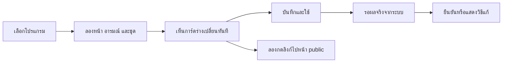

# Presence Studio — Experience & Motion Spec

วันที่ 2026-09-05 · ส่วนขยายของ [Final Plan Draft](FINAL-PLAN-DRAFT.md)

สถานะ: เพิ่มข้อกำหนดตามคำขอเจ้าของแล้ว รายละเอียดภาพและค่าการเคลื่อนไหวด้านล่างเป็นแนวทางเสนอสำหรับรอบออกแบบ ไม่ใช่ UI ที่สร้างหรือทดสอบเสร็จ

## 1. เป้าหมายของความใส่ใจในงาน

เจ้าของเปิด Studio แล้วรู้สึกว่าเป็นพื้นที่แต่งตัวตนบน Discord ที่น่าใช้ มีสีสัน และตอบสนองต่อมือ การเลือกแอป ลองชุด เปลี่ยนอารมณ์ และส่งการ์ดต้องต่อเนื่องกัน เห็นผลทันทีในร่างและเข้าใจว่าอะไรออกไปให้เพื่อนเห็นแล้ว

คุณภาพภาพ การโต้ตอบ และ motion เป็นส่วนหนึ่งของงานที่ต้องส่งมอบตั้งแต่รุ่นแรก ไม่ใช่รายการแต่งเพิ่มหลังทำฟีเจอร์เสร็จ ผู้ใช้ระบุว่า UI ปัจจุบันดูหุ่นยนต์และขาดสีสัน ต้องเปลี่ยนประสบการณ์นี้โดยคงความง่ายและพฤติกรรมที่เชื่อถือได้

Studio เป็นพื้นที่ลงมือแต่งและควบคุม ส่วน Personal Space เป็นพื้นที่ให้ผู้ชมสำรวจรสนิยมและผลงาน ทั้งสองมีลายเซ็นคนชิบิร่วมกัน แต่ไม่จำเป็นต้องใช้ layout หรือความหนาแน่นเท่ากัน

## 2. หลักฐานจากหน้าปัจจุบัน

ตรวจ scripts/discord-presence-studio.html และภาพ docs/images/studio-overview.png ใน C:/letmecook/spotify-vibe ภาพนี้เป็นภาพใน repo ไม่ใช่ live screenshot ของรอบนี้

- CSS :root ใช้พื้นกรมท่าและแผงเข้ม มี accent สีอยู่แล้ว แต่พื้นที่ส่วนใหญ่เป็นฟอร์มและกรอบ ทำให้สีไม่ได้สื่อบุคลิกของตัวที่กำลังแต่ง
- .button ใช้ text 11px, .button.small 9px, .journey-copy small 8px; การใช้งานจริงต้องอ่าน label และสถานะให้สบายขึ้น โดยเฉพาะภาษาไทย
- มี transition ของ journey/switch/preview highlight บางจุด ยังไม่มี sequence เชื่อมการลองลุคกับผลบนการ์ดหรือการเผยแพร่
- renderSceneList สร้างรายการใหม่ขณะอัปเดต state; งาน motion ใหม่ต้องรักษา identity/focus/scroll ของรายการ ไม่ animate ทุกแถวซ้ำเมื่อ poll
- มี reduced-motion CSS สำหรับ transition แต่ GIF ต้องมีภาพนิ่งทดแทนแยก เพราะปิด CSS transition ไม่ได้หยุดการเล่น GIF
- Editing Preview และสถานะการส่งที่แยกกันเป็นฐานที่ควรรักษา ไม่เปลี่ยนเป็นเอฟเฟกต์สำเร็จที่ทำให้เข้าใจผิดว่าส่งแล้ว

## 3. ทิศทางที่เสนอ: พื้นที่ลองลุคของตัวเรา

ความรู้สึกหลักคือเลือกโปรแกรมหนึ่งตัว แล้วแต่ง “ตัวเราเมื่อใช้แอปนี้” ผ่านหน้าชิบิและการ์ดที่เห็นอยู่ด้วยกัน

องค์ประกอบที่ต้องมีตั้งแต่หน้าจอแรก:

- รายการโปรแกรมที่อ่านชื่อและเห็นลุคที่จับคู่ไว้ได้ทันที
- โปรแกรมที่กำลังแก้และความสัมพันธ์กับโปรแกรมที่กำลังใช้งานจริง
- หน้าคนชิบิขนาดที่เห็นรายละเอียดหน้า/คอเสื้อ และตัวเลือกอารมณ์หรือชุดที่หยิบลองได้
- การ์ด Discord ที่แยกขนาดเหมือนพื้นที่ผู้ชมจากภาพชิบิขนาดใหญ่สำหรับแต่ง
- ปุ่มหลักหนึ่งจุดสำหรับเปิดใช้ร่าง พร้อม feedback การบันทึกที่อยู่ใกล้กัน
- Auto / Pin / Hide และอารมณ์ปัจจุบันเข้าถึงง่าย ไม่ปะปนกับฟอร์มลิงก์หรือ credentials

ตำแหน่งซ้าย/กลาง/ขวาและรูปแบบ panel ยังเลือกได้ในรอบ mockup ข้อกำหนดคือรักษา app → look → result ในสายตาเดียว ไม่บังคับเข้าหลายหน้าเพื่อเปลี่ยนชุดหนึ่งครั้ง

## 4. ภาษาภาพที่ต้องออกแบบ

### สีและพื้นผิว

- สีสดจากชุดคนชิบิเป็นจุดเด่นในบริเวณลองชุด/อารมณ์/การเลือกแอป พื้นสำหรับอ่านและกรอกช่วยให้เนื้อหาชัด ไม่ย้อมทุกพื้นผิวด้วยสีเดียว
- ทิศทางทดลอง: น้ำเงินอมม่วงที่ไม่ดำทึบ + สีพีช/เหลือง/ฟ้าสดจากชุดมนุษย์ชิบิ สีจริงต้องเลือกพร้อมตัวละคร ไม่สืบทอด palette ของมาสคอตสีเขียวที่ยกเลิกแล้ว
- แยกสีแสดงบุคลิกออกจากสีบอกสถานะ เช่น mood ที่ใช้สีแดงต้องไม่ดูเหมือนระบบผิดพลาด และ status สำคัญมีคำกับสัญลักษณ์ประกอบ
- คุมลำดับน้ำหนักจากพื้นเงียบ → เนื้อหา → สิ่งที่เลือก → การกระทำหลัก ใช้ช่องว่างและการจัดกลุ่มเพื่อลดกรอบซ้อนหลายชั้น
- มีรายละเอียดเฉพาะงาน เช่น ช่องชุดที่มองเห็น texture/pixel ของเสื้อ badge ประจำแอป และ thumbnail ลุคจริง แทนไอคอนตกแต่งที่ไม่บอกอะไร

### ตัวอักษรและภาพ

- ใช้ฟอนต์ UI อ่านไทย/อังกฤษได้ดีสำหรับ label, input, help และ errors; pixel lettering ใช้เฉพาะชื่อ/เครื่องหมายสั้นที่อ่านออก
- ขนาดหลักเสนอ 14–16px, ข้อความรอง 12–14px; ข้อความจำเป็นไม่ลดเหลือ 8–9px เพียงเพื่อใส่ทุกอย่างในหน้าเดียว
- หน้าคนชิบิเป็นต้นฉบับเดียวกับ GIF ที่ใช้บน Discord ลองผม/หน้า/ชุดแล้วต้องยังจำได้ว่าเป็นคนเดิม
- แสดงทั้งภาพแต่งขนาดใหญ่และตัวอย่างขนาดการ์ดเล็ก เพื่อตรวจว่าชุดและสีหน้าอ่านออกเมื่อย่อจริง
- การ์ด preview คงภาษาภาพและข้อจำกัด Discord; แผง Studio รอบการ์ดมีบุคลิกของแอปได้ ไม่วาด banner/effect ที่ผู้ชม Discord จะไม่ได้รับให้ดูเหมือนเป็นของจริง

## 5. การใช้งานที่ต้องต่อเนื่อง

### เลือกและจับคู่แอป

- เปิด picker แล้วเริ่มจากรายการแอปที่เปิดอยู่ ใช้ icon/name ที่ตรวจได้ พร้อม search และ fallback ตาม F1
- เลือกแล้วแอปนั้นยังเป็นจุดยึดระหว่างแต่ง ชื่อ/ไอคอนไม่หายเมื่อเปิดส่วนย่อย
- เสนอการเคลื่อนสั้นจากแถวแอปไปบริเวณแก้ไขเพื่อบอกว่า “กำลังแต่งอันนี้”; คืนตำแหน่งเมื่อกลับรายการ
- กฎ Auto ที่เปลี่ยนระหว่างแต่งอัปเดตเฉพาะพื้นที่ Now ไม่แย่งโปรแกรมที่เจ้าของกำลังแก้ ไม่สลับ input หรือทิ้ง draft

### ลองอารมณ์และชุด

- เลือกจากภาพย่อและชื่อที่เข้าใจได้; ลุคที่เลือกมีสถานะชัด แยกการ hover ทดลองจากการเลือกจริง
- Mood/outfit picker ใน editor เปลี่ยนเฉพาะร่าง ส่วน quick control ของอารมณ์ปัจจุบันใช้ทันทีตาม F3 มีขอบเขตบอกข้าง control
- ห้ามใช้ control หน้าตาเดียวกันโดยไม่บอกว่ากำลังแต่งร่างหรือเปลี่ยนของที่เปิดใช้งาน
- การเปลี่ยนลุคคงตำแหน่งหน้า ดวงตา และขนาด portrait เพื่อเห็นว่าเป็นคนเดิมเปลี่ยนสภาพ
- preview outfit อาจใช้ SVG/เฟรมในเครื่องเพื่อให้ตอบสนองทันที; เมื่อจะใช้จริงต้องมี GIF version ที่พร้อม ก่อนเปลี่ยนของที่เผยแพร่
- เลือกสลับอย่างรวดเร็วให้ค่าสุดท้ายชนะ ยกเลิก transition ที่ค้าง ไม่เล่นทุกการเปลี่ยนตามคิว
- มีเปรียบเทียบก่อน/หลัง และกลับค่าร่างที่เปิดใช้ล่าสุดได้โดยไม่กระทบการ์ดอื่น

### แต่งข้อความและลิงก์

- เน้นช่องที่เพื่อนเห็นก่อน; links, hover, timer และ metadata เปิดเพิ่มเติมได้โดยมีสรุปว่าตั้งอะไรไว้
- focus ช่องใดให้ตำแหน่งที่เกี่ยวข้องบน preview มีเส้น/แสงเน้นสั้น ๆ; ไม่ขยาย/ย้ายการ์ดจนต้องไล่ตาม
- พรีวิวลิงก์แสดงปลายทางชัดและมีปุ่มทดสอบ ครอบคลุมรูปใหญ่ รูปเล็ก details/state และปุ่มทั้งสอง
- ภาษาไทยวรรณยุกต์ไม่ถูกตัด; แสดงผลกรณีชื่อโปรแกรม/ข้อความยาวโดยไม่บิด layout และแจ้งเมื่อมีแนวโน้มถูกตัดบน Discord

## 6. Interaction & animation ที่ต้องส่งมอบ

เวลาต่อไปนี้เป็นค่าเริ่มต้นเสนอสำหรับทดสอบ ไม่ใช่เวลาที่วัดจากแอปปัจจุบัน ทุก animation ต้องขัดจังหวะได้และไม่หน่วงการกระทำจริง

| เหตุการณ์ | สิ่งที่ผู้ใช้เห็น | ความหมาย/เงื่อนไข |
|---|---|---|
| Hover/focus ปุ่มหรือ app row | สี/น้ำหนักเปลี่ยน และแสดง affordance | ตอบสนองราว 100–150 ms; keyboard มี feedback เท่าเทียม |
| กดปุ่ม | ยุบตัวเล็กน้อยแล้วคืน | สัมผัสกดได้จริง ไม่เด้งทั้งหน้า ไม่สั่นตัวหนังสือ |
| เลือกแอปมาแต่ง | ตัวเลือกเลื่อนไปแถวใหม่และบริเวณแก้เปลี่ยนอย่างต่อเนื่อง | 150–250 ms; คง search, focus และ scroll |
| เลือก mood | หน้าชิบิแสดงอารมณ์ใหม่ทันที อาจกระพริบตารับหนึ่งครั้ง | 150–300 ms; ไม่เล่นปฏิกิริยาใหม่ทุกครั้งที่ poll state |
| ลองชุด | เสื้อ/เครื่องประดับเปลี่ยนโดยหน้าอยู่ตำแหน่งเดิม | reveal สั้น/เฟรมขั้นบันไดตาม pixel art ไม่ morph จนหน้าดูเป็นอีกคน |
| เปลี่ยนชุดครั้งแรกใน flow | ชิบิเอียงหัวเล็กน้อยเหมือนลองลุค | เป็นจังหวะเด่นของพื้นที่แต่ง; จำกัดช่วงสั้นและไม่ขวางการเลือกต่อ |
| เปิดรายละเอียด/เลือกภาพ | แผงเผยออกสัมพันธ์กับปุ่มต้นทาง | 200–300 ms; โฟกัสและ Esc/กลับทำงาน ไม่ใช้ modal ซ้อนหลายชั้น |
| แก้ข้อความ | preview เปลี่ยนทันที พร้อมชี้ตำแหน่งที่แก้ | ไม่ animate ตัวอักษรทีละตัว ไม่ให้ caret หลุด |
| กดบันทึกและใช้ | ปุ่มแสดงกำลังทำงาน แล้วจึงแสดงเครื่องหมายสำเร็จ | รอผลจริง; สำเร็จสั้น 200–350 ms ไม่ปล่อย particle/confetti ทุก save |
| Discord ยังไม่เชื่อมต่อ | แสดง “บันทึกแล้ว รอ Discord” ในตำแหน่งเดิม | ไม่มี animation ที่สื่อว่าส่งสำเร็จไปแล้ว |
| Auto เปลี่ยนการ์ด | thumbnail ใน Now และชื่อเหตุผลเปลี่ยนอย่างนุ่มนวล | 150–250 ms; ไม่เปิด toast ทุกครั้งหรือขยับ editor |
| Hide/Pause | indicator และข้อความเปลี่ยนตรงกับคำสั่ง | หน้าและปุ่มยังหาเจอ ใช้เอฟเฟกต์ไม่ทำให้เข้าใจว่าข้อมูลถูกลบ |
| ระบบผิดพลาด | แสดงปัญหา วิธีแก้ และ retry ใกล้ action | ไม่ใช้ชิบิร้องไห้/มุกแทนข้อผิดพลาด ไม่สั่นฟอร์มยาว |
| Undo | คืนค่าที่คาดหมายพร้อม feedback สั้น | ไม่ undo ผ่าน animation เก่าย้อนหลายขั้น |

motion ใน Studio มีหน้าที่สื่อการเปลี่ยนค่าและให้ความรู้สึกน่าจับต้อง เอฟเฟกต์ชุดนี้ไม่ใช่สิ่งที่จะส่งไปเล่นบน UI ของ Discord; Discord รับ GIF และข้อมูลตาม field ที่รองรับเท่านั้น

## 7. ความน่ารักในสถานะที่ถูกลืมง่าย

- **ครั้งแรก:** เห็นคนชิบิและตัวอย่างการ์ดพร้อมคำว่า preview เลือกโปรแกรมแรกแล้วปรับได้เลย การตั้ง Application ID อยู่ในขั้นเชื่อมต่อพร้อมคำช่วยชัด ไม่ให้ credential banner หลายอันแย่งหน้าจอทั้งหมด
- **ยังไม่จับคู่แอป:** หน้าว่างมีคำสั้น เช่น “เริ่มจากแอปที่ใช้บ่อย” กับ action เพิ่มแอป และตัวอย่างที่ระบุว่าเป็นตัวอย่าง
- **หาแอปไม่พบ:** เก็บคำค้นไว้ เสนอเปิดโปรแกรมนั้นแล้ว refresh หรือเลือกไฟล์เอง ไม่พากลับจุดเริ่มต้น
- **กำลังเตรียม GIF:** แสดงขั้นที่ทำจริง พร้อมใช้ภาพเดิมต่อ ไม่ใส่เปอร์เซ็นต์ที่ไม่ได้วัดและไม่เพิ่ม delay เพื่อโชว์ animation
- **ลุคยังไม่รองรับ:** thumbnail อธิบายสิ่งที่ขาดและเสนอ fallback ไม่เลือกแล้วเงียบ/รูปแตก
- **บันทึกไม่ได้:** เก็บ draft และตำแหน่งการแก้ไว้ retry ได้ ไม่โยนรายละเอียดระบบยาวบนหน้าหลัก
- **ต่อ Discord กลับได้:** แจ้งสถานะสั้นในตำแหน่งเดิมและส่งค่าล่าสุด ไม่ replay notification ทั้งหมด
- **ข้อความทั่วไป:** ใช้ภาษาพูดตรง ๆ เช่น “ลองชุดนี้”, “กลับตามแอป”, “บันทึกแล้ว”; ความกวนอยู่ในคาแรคเตอร์/เนื้อหาที่เจ้าของเลือก ไม่แทรกทุกปุ่มหรือทุก error

## 8. Motion, accessibility และประสิทธิภาพ

- มีตัวเลือก Motion ตามระบบ/ลดการเคลื่อนไหว และให้ปรับ animation preview ได้
- reduced motion ใช้การเปลี่ยนสถานะทันที/เส้นเลือกชัด พร้อม PNG poster สำหรับ GIF ใน Studio และหน้า public; CSS อย่างเดียวหยุด GIF ไม่ได้
- preference ในเว็บควบคุมการเล่นภาพบน Discord ไม่ได้ ถ้าจะใช้ภาพนิ่งบน Discord ให้เจ้าของเลือก output PNG แยกอย่างชัดเจน
- animated look gallery เล่นเฉพาะรายการที่ focus/hover/เลือก เหลือภาพนิ่งสำหรับรายการอื่น; ไม่ decode GIF ทุกชุดในกริดพร้อมกัน
- หยุดงาน animation/rendering ที่ไม่จำเป็นเมื่อซ่อนแท็บ/องค์ประกอบพ้นจอ ไม่ให้การเปิด Studio ข้างเกมกินทรัพยากรต่อเนื่องโดยไม่จำเป็น
- ไม่ส่ง RPC/public state ตาม frame หรือ hover; สร้าง GIF เมื่อจำเป็นตาม pipeline และส่ง output เมื่อมีค่าที่เปิดใช้เปลี่ยน
- ไม่มีเสียงอัตโนมัติ เอฟเฟกต์เสียงไม่เป็นข้อกำหนดรุ่นแรก
- ไม่มี flashing/การเด้งขนาดใหญ่ต่อเนื่อง สีไม่เป็นวิธีเดียวที่สื่อ selection/error/success
- เป้าหมายตรวจ: text contrast ตาม WCAG AA, focus ชัด, ลำดับ Tab และ screen reader labels ถูก, popover คืน focus, touch target ใช้งานสะดวก
- รองรับ desktop 1280/1440/1920 px, หน้าต่างแคบ 768 px และ zoom 200% โดยเนื้อหา/action ไม่ล้นหรือถูก sticky panel บัง; มือถือสำหรับหน้า public ทดสอบแยก ไม่สื่อว่าเข้า Studio บนมือถือแล้วตรวจแอป PC ได้
- ไม่บังคับ dependency animation ใหม่ในสเปกนี้ เลือกเทคนิคตาม prototype และวัดกับเครื่องที่ใช้จริง

## 9. งานออกแบบที่ต้องมีในแผนส่งมอบ

1. Mockup ด้วยเนื้อหาจริงของ flow: เลือกแอป → ลองอารมณ์/ชุด → การ์ดร่าง → ใช้จริง และสถานะ disconnected/error
2. ชุดคนชิบิและ preview ในขนาด Discord ที่ตรวจ silhouette, หน้า, คอเสื้อ/เครื่องประดับ และภาษาไทย
3. Interactive prototype ที่แสดงจังหวะเด่นการลองลุค, การเลือกเร็วต่อเนื่อง และ save/reconnect ไม่ใช่ภาพนิ่งหน้าสวยเพียงหน้าเดียว
4. Component states ครบ hover/focus/pressed/selected/disabled/loading/success/error/empty พร้อม palette, type, spacing และ motion rules ที่ตกลงจาก prototype
5. การตรวจ UI จริงพร้อม build ของแต่ละฟีเจอร์ และรอบ craft review รวมก่อนส่งมอบ ไม่เลื่อนทั้งส่วนไปหลัง release

ไม่มีการสร้าง mockup/prototype ใหม่ในรอบแก้สเปกนี้ และไม่มีการล็อก palette, layout, framework หรือทรงผมเจ้าของแทนคำตอบในรอบดีไซน์

## 10. เกณฑ์รับงานด้านประสบการณ์

| รหัส | ทดลอง | ผ่านเมื่อ |
|---|---|---|
| UX-01 | เปิด Studio แล้วเลือกแอป | รู้ว่ากำลังแต่งแอปใด, แอปใดกำลังควบคุม Presence และหาปุ่มลองลุคได้โดยไม่ต้องอ่านคู่มือ |
| UX-02 | เปลี่ยน mood ใน quick control | จากหน้าแรกใช้ไม่เกินเปิด picker + เลือก mood และเห็นขอบเขต/อายุของมัน; ค่าเริ่มต้นนี้เป็นเป้าทดสอบ |
| UX-03 | ทดลอง mood/outfit ใน editor | เห็นเฉพาะร่างเปลี่ยน จนกดใช้จึงเปลี่ยนค่าที่เปิดใช้งานจริง |
| UX-04 | สลับ mood/ชุดเร็ว 10 ครั้ง | ลุคสุดท้ายถูกต้อง ไม่มีคิว animation พาไปลุคเก่า ไม่มี RPC ตาม hover/ทุกเฟรม |
| UX-05 | Auto เปลี่ยนแอปขณะกำลังพิมพ์ | editor, focus, caret และ scroll อยู่ที่เดิม; Now อัปเดตแยกและไม่มี toast รบกวน |
| UX-06 | ส่งสำเร็จ/ล้มเหลว/Discord offline | feedback ตรงกับผลจริงทุกกรณี ไม่แสดงเอฟเฟกต์สำเร็จก่อนมี acknowledgement |
| UX-07 | เปลี่ยนชุดทั้งวัน | คนชิบิยังเป็นคนเดิม timer ไม่ reset และลุคที่ไม่พร้อมมี fallback ชัด |
| UX-08 | กดรูป/ข้อความ/ปุ่มใน preview | เห็นปลายทางที่ถูกต้องและรู้ว่าเป็นการทดลองลิงก์; ตรวจ Discord ด้วยผู้ชมแยก |
| UX-09 | เปิด reduced motion | ไม่มี loop อัตโนมัติที่ไม่จำเป็นบนเว็บ, ใช้ poster แทน GIF, การเลือกและผลลัพธ์ยังชัด |
| UX-10 | เปิด gallery แล้วสลับแท็บ | ไม่เล่น/สร้างภาพทุกลุคต่อเนื่องใน background; วัดว่าไม่ทำให้เกม/Studio สะดุดจากงานตกแต่ง |
| UX-11 | ใช้ keyboard, Thai text และ zoom 200% | ปุ่ม/ข้อความไม่โดนตัด โฟกัสถึงครบ ไม่มีสถานะที่เข้าใจได้เฉพาะ hover/สี |
| UX-12 | ใช้ flow เดิมซ้ำหลายครั้ง | ไม่มี intro/celebration ที่ต้องรอซ้ำ ไม่มีการบังคับเดิน wizard เมื่อแค่เปลี่ยนอารมณ์ |

ความพร้อมส่งมอบต้องผ่านทั้ง functional scenarios ในแผนหลักและ UX-01 ถึง UX-12 ส่วน visual preference สุดท้ายใช้ภาพ/interaction ที่เจ้าของเลือกเป็นหลัก ไม่ใช้คำว่า “น่ารัก” อย่างเดียวเป็นเกณฑ์ผ่าน
